# CSS(Cascading Style Sheets)

## 개념


## 장점

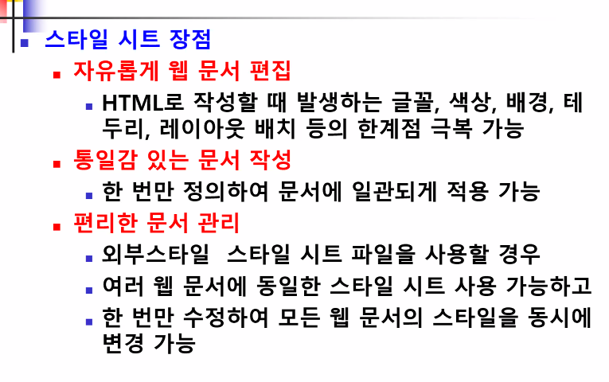


## 스타일시트 적용 방법

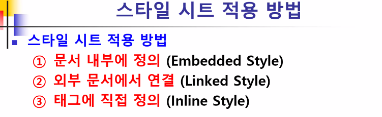


### 1) 문서 내부에 정의

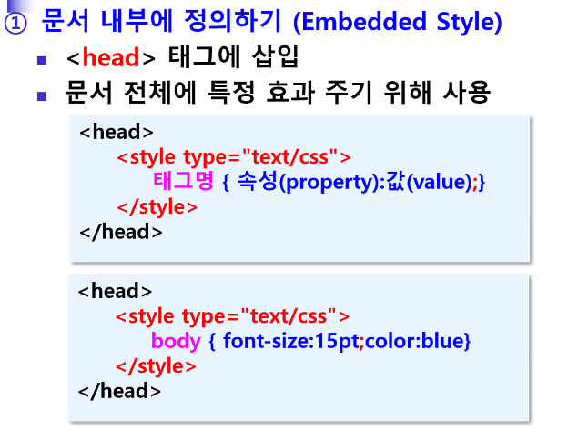

```html
<style type="text/css">
	body {font-size: 15pt; color:blue}
</style>
```


### 2) 외부 문서에서 연결

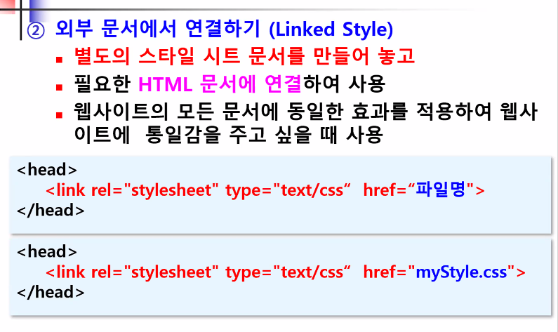


### 3) 태그에 직접 정의

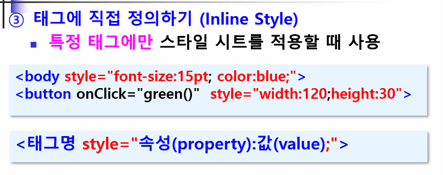


## 스타일 시트의 기본 형식

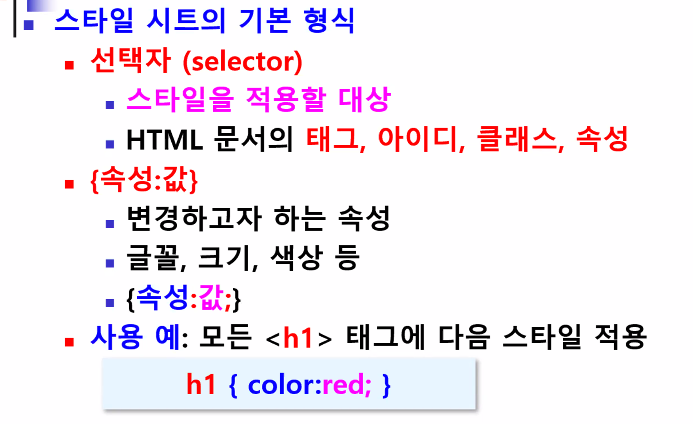


### 태그 선택자

```html
<!doctype html>
<html>
    <head>
        <meta charset="UTF-8">
        <title>태그 선택자</title>
		<style type="text/css">

			/* h3 태그(요소)에 관련된 css 속성 정의 */
			h3 {
				background-color:#000;
				color:#FFF;
				width: 50%;
				margin-left: 20px;
				}
		</style>
	</head>

	<body>
		<h1>태그 선택자 사용하기</h1>
		<hr>
		<h2>두부감자조림</h2> 
		<h3>재료</h3>
		<ul>
			<li>감자 1개</li>
			<li>두부 1/2모</li>
			<li>꽈리고추 10개</li>
			<li>홍고추 1개</li>
		</ul>
		<h3>조리법</h3>
		<ol>
			<li>감자는 껍질을 벗기고 돌려가면서 어슷하게 썰어 찬물에 담가놓고 두부는 도톰하게 한입크기로 썰며 꽈리고추, 홍고추는 어슷썬다.</li>
			<li>첫번째 썰은 재료에 두부를 팬에 기름을 두르고 노릇노릇하게 앞뒤로 지져 기름은 뺀다. </li>
			<li>냄비에 감자와 홍고추를 담고 조림장을 반분량만 넣는다. </li>
			<li>3번째를 끓이다가 감자가 반정도 익으면, 두부와 남은 양념장을 넣는다. </li>
			<li>윤기나게 졸여지면 꽈리고추를 마지막에 넣어 다시한번 살짝 졸여 조린다.</li>
		</ol>
	</body>
</html>

```


### 클래스 선택자

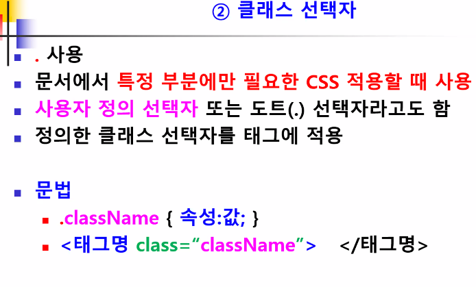


### 아이디 선택자

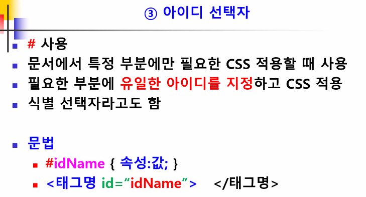

* 아이디는 유일한 식별자여야 함


## CSS 속성

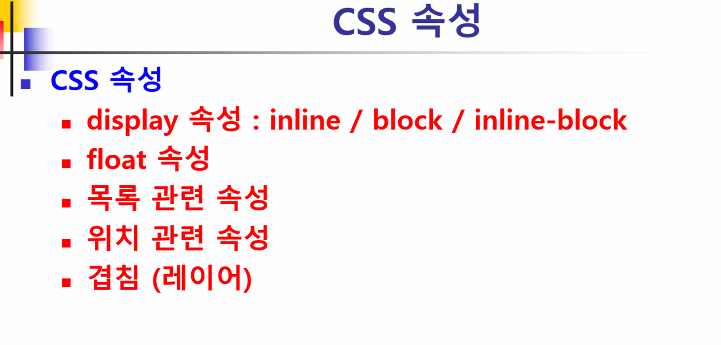

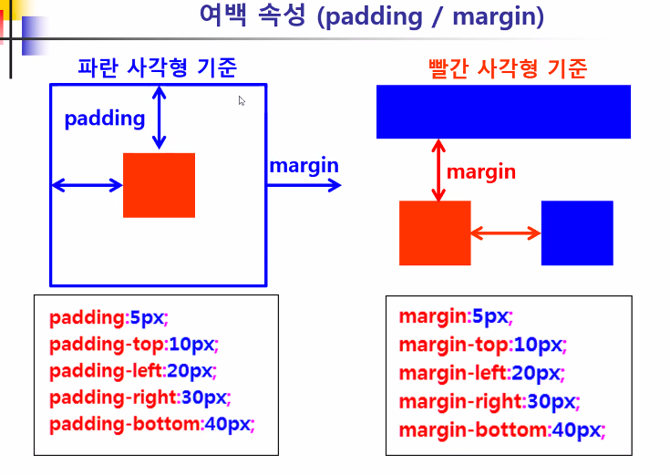


### Inline/block/inline-block

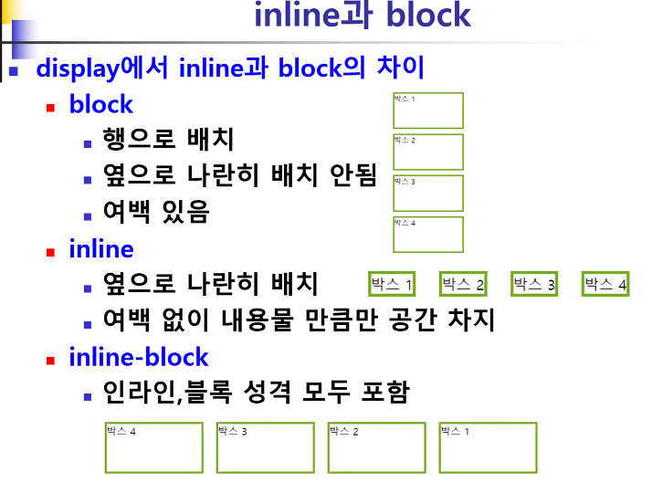


### float 

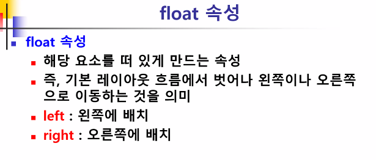

```html
<!DOCTYPE html>
<html lang="en">
<head>
    <meta charset="UTF-8">
    <title>inlineBlock 예제</title>
    <style type="text/css"> /* display 속성이 생략되면 block이 디폴트 행으로 배치/여백있음 */
        .greenBox {
            /*display: block;*/
            /*display:inline; display 속성 값이 inline인 경우
            width,height 속성은 적용되지 않는다. 옆으로 배치되면서 내용만큼만 공간 차지*/
            /*display:inline-block; */ 옆으로 배치되는 inline 속성과 width, height 속성이 적용되는 block 속성을 결합해놓은 속성값*/
            float: right;
            width:150px;
            height:75px;
            margin:10px;
            border:solid 3px #73AD21;
        }
    </style>
</head>
<body>
    <h2>display 속성(block/inline/inline-block)</h2>
    <div class="greenBox">박스1</div>
    <div class="greenBox">박스2</div>
    <div class="greenBox">박스3</div>
    <div class="greenBox">박스4</div>
</body>
</html>
```


### 목록

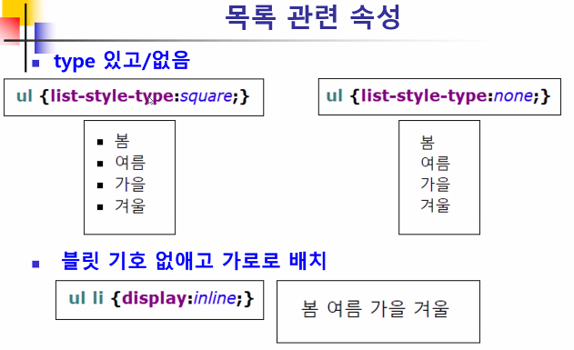


### 위치

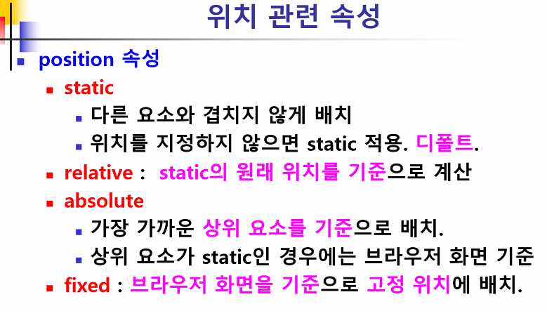