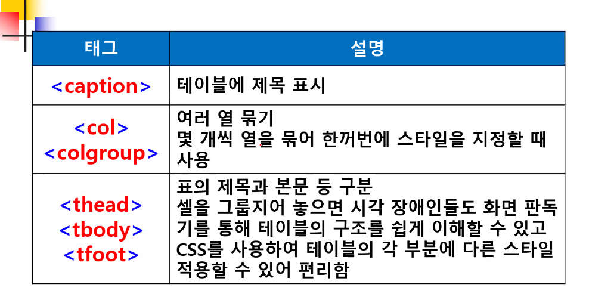

# HTML

## 기본 태그


## 문서 구조 태그


* 스타일코드와 html 소스는 연결해서 사용

  


## 텍스트 관련 태그


* 글자 크기 조절은 h 태그를 이용하여 조절하지 않음
* 크기가 클수록 페이지에서 중요한 내용


* strong 태그가 b 태그보다 검색 로봇의 검색율이 좋음

  


* &nbsp 자주 사용됨


## 하이퍼링크 태그


* 상대경로(나보다 파일의 위치가 얼마나 떨어져 있나를 표시) 사용


* blank, self 자주 사용


## 목록 태그


* `reversed` : 다른 브라우저에서 동작하지 않는 속성은 잘 사용하지 않음


### 예제1) 중첩 목록


```html
<!DOCTYPE html>
<html lang="en">
<head>
    <meta charset="UTF-8">
    <title>중첩 목록 태그</title>
</head>
<body>
    멀티미디어 콘텐츠 제작
<ol type="1">
    <li>웹 프로그래밍</li>
        <ul type="squere">
            <li>jsp</li>
            <li>asp</li>
            <li>php</li>
        </ul>
    <li>웹 디자인</li>
        <ul type="i" start="1">
            <li>html</li>
            <li>css</li>
            <li>javascrip</li>
        </ul>
    <li>
        <ol type="A">
            <li>네이티브 앱</li>
            <li>네이티브 앱</li>
            <li>네이티브 앱</li>
                <ul type="circle">
                    <li>jQuery 프레임 워크</li>
                    <li type="circle">Sencha Touch 프레임 워크</li>
                </ul>
            <li>네이티브 앱</li>
        </ol>
    </li>
</ol>
</body>
</html>
```


### 예제2) 중첩목록


```html
<!DOCTYPE html>
<html lang="en">
<head>
    <meta charset="UTF-8">
    <title>컴퓨터 관련 보유 기술</title>
    <ul type="disc">
        <li>프로그래밍</li>
        <ul type="circle">
            <li>웹 프로그래밍</li>
            <ol type="1">
                <li>JSP/Serverlet</li>
                <li>HTML/JAavaScript/jQuery</li>
            </ol>
            <li>모바일 프로그래밍</li>
            <ol type="1">
                <li>Java</li>
                <li>안드로이드</li>
            </ol>
        </ul>
        <li>웹 및 모바일 프로그래밍</li>
            <ol type="1">
                <li>포토샵</li>
                <li>Illustrator</li>
                <li>HTML5/CSS3</li>
            </ol>
        <li>데이터 베이스</li>
            <ol type="1">
                <li>Mysql</li>
                <li>Ms SQL Server</li>
                <li>Oracle</li>
            </ol>
    </ul>
</head>
<body>

</body>
</html>
```


## 테이블 태그





## 이미지 태그


### 예제)


```html
<!DOCTYPE html>
<html lang="en">
<head>
    <meta charset="UTF-8">
    <title>테이블이미지 연습문제</title>
    <style>
        table { margin:0 auto; width: 700px; text-align:center;}
        th { width:120 px;}
    </style>
</head>
<body>
    <table border="1">
        <tr><td rowspan="8" width="222"></td>
            <td>작품명</td>
            <td colspan="3">모나리자</td>
        </tr>
        <tr><td><b>화가</b></td><td colspan="3">레오나르도 다 빈치</td></tr>
        <tr><td><b>시대</b></td><td colspan="3">15세기경</td></tr>
        <tr><td><b>기법</b></td><td colspan="3">패널에 유채</td></tr>
        <tr><td><b>크기</b></td><td colspan="3">77x53</td></tr>
        <tr><td rowspan="2"><b>가<br/>격</b></td><td><b>정가</b></td><td colspan="2">700억원</td></tr>
        <tr><td><b>판매가</b></td><td colspan="3">500억원</td></tr>
        <tr><td><b>소장기관</b></td><td colspan="3">루브르박물관</td></tr>


    </table>
</body>
</html>
```


### `usemap` 속성


* 좌표값은 그림판으로 그림파일 열기 후 마우스로 해당 위치를 포인팅하면 왼쪽 아래에 뜬다.

```html
<map name="cityMap">
	<area shape="rect" coords="x,y,x,y" href="연결.html">
</map>
```


## 입력양식 태그


##### 

### GET과 POST의 차이

GET은 Idempotent, POST는 Non-idempotent하게 설계되었습니다.
Idempotent(멱등)은 수학적 개념으로 다음과 같이 나타낼 수 있습니다.

> 수학이나 전산학에서 연산의 한 성질을 나타내는 것으로, 연산을 여러 번 적용하더라도 결과가 달라지지 않는 성질

즉, 멱등이라는 것은 **동일한 연산을 여러 번 수행하더라도 동일한 결과**가 나타나야 합니다.
여기서 GET이 Idempotent하도록 설계되었다는 것은 GET으로 **서버에게 동일한 요청을 여러 번 전송하더라도 동일한 응답이 돌아와야 한다는 것**을 의미합니다. 이에 따라 GET은 설계원칙에 따라 서버의 데이터나 상태를 변경시키지 않아야 Idempotent하기 때문에 **주로 조회를 할 때에 사용**해야합니다. 예를 들어, 브라우저에서 웹페이지를 열어보거나 게시글을 읽는 등 조회를 하는 행위는 GET으로 요청하게 됩니다.

반대로 POST는 Non-idempotent하기 때문에 **서버에게 동일한 요청을 여러 번 전송해도 응답은 항상 다를 수 있습니다**. 이에 따라 POST는 서버의 상태나 데이터를 변경시킬 때 사용됩니다. 게시글을 쓰면 서버에 게시글이 저장이 되고, 게시글을 삭제하면 해당 데이터가 없어지는 등 POST로 요청을 하게 되면 서버의 무언가는 변경되도록 사용됩니다. 이처럼 POST는 생성, 수정, 삭제에 사용할 수 있지만, 생성에는 POST, 수정은 PUT 또는 PATCH, 삭제는 DELETE가 더 용도에 맞는 메소드라고 할 수 있습니다.


## 공간분할 태그


## HTML5 시멘틱 구조 태그


* div, section 자주 사용

* 시멘틱 검색 로봇의 검색 효율을 높일수 있음

  ex. header와 section 안의 article만 검색


### 웹 표준 문서 구조


### 시멘틱 구조의 특징과 장점


