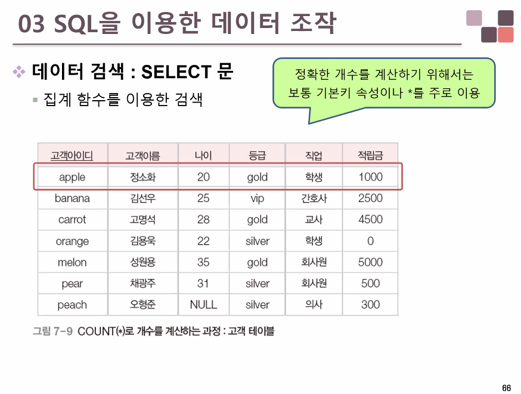

# 테이블

## 트리거

```mysql
DELIMITER //
CREATE TRIGGER tra_deletedmemberTBL -- 트리거이름
	AFTER DELETE -- 삭제 후에 작동하게 지정
	ON memberTBL -- memberTBL 에서 삭제가 일어나면 트리거 동작
	FOR EACH ROW -- 각각행마다 적용
BEGIN
	INSERT INTO deleteMemberTBL 
	VALUES(OLD.memberID, OLD.memberName, OLD.memberAddress, CURDATE()); 
END
	
DELIMITER;
```


## mySQL은 서비스에서 구동된다

윈도우의 서비스(시작>검색'서비스')로 접근 가능
만일 개발중 DB가 내려가 프로그램이 작동이 안되면 서비스에서 mysql 실행여부 먼저 살펴볼것


## 권한문제 해결 (cmd에 입력) 

```
[mysqld]
datadir=C:/Program Files/MariaDB 10.3/data
port=3306
innodb_buffer_pool_size=3833M
character-set-server=utf8
[client]
port=3306
plugin-dir=C:/Program Files/MariaDB 10.3/lib/plugin
```


## CREATE


## SELECT

### 실행순서





### LIKE 검색 키워드

```mysql
-- 검색 키워드
-- LIKE : 기호 %나 _와 함께 사용
-- % : 0개 이상의 문자(문자의 내용과 개수는 상관 없음)
-- _ : 1개의 문자(문자의 내용은 상관 없음)
-- LIKE '데이터%' 데이터로 시작하는 문자열(데이터로 시작하면 길이는 상관 없음)
-- 김 데이터(X)
-- 데이터(O)
-- 데이터 사무소(O)
-- 김씨인 사람 LIKE '김%'

-- LIKE %데이터 : 데이터로 끝나는 문자열
-- 데이터 사무소(X)
-- 빅데이터(O)
-- 빅데이터 사무소(X)

-- LIKE %데이터% : 데이터가 포함된 문자열
-- 빅데이터 사무소(O)
-- 빅데이터(O)
-- 데이터 사무소(O)
-- 서울에 사는 사람 LIKE %서울%

-- LIKE '데이터_ _ _' : 데이터로 시작하는 6자길이의 문자열
-- 데이터사무소(O)
-- 강남 데이터(X)

-- LIKE '_ _ 데이터' : 데이터로 끝나고 5자 길이의 문자열
-- 양재데이터(O)
-- 1데이터장(X)

-- LIKE '_ _한%' : 세번째 글자가 '한'인 문자열

-- 고객 테이블에서 성이 김씨인 고객이름, 나이, 등급, 적립금 검색
SELECT 고객이름, 나이, 등급, 적립금
FROM 고객
WHERE 고객이름 LIKE '김%';

-- 고객 테이블에서 아이디가 5자인 고객 아이디, 고객 이름, 등급 검색
SELECT 고객아이디 , 나이, 등급, 적립금
FROM 고객
WHERE 고객아이디 LIKE '_____';
```


### NULL 키워드

```mysql
-- NULL 키워드
-- IS NULL : 값이 NULL 인지 확인
-- IS NOT NULL : 값이 NULL 이 아닌자 확인
-- 검색조건에서 널값은 다른 값과 크기를 비교하면 결과가 모두 거짓이 됨

-- 고객테이블에서 나이가 아직 입력되지 않은 고객의 고객 이름 검색
SELECT 고객이름
FROM 고객
WHERE 나이 IS NULL;

-- 고객테이블에서 나이를 입력한  고객의 고객 이름 검색
SELECT 고객이름
FROM 고객
WHERE 나이 IS NOT NULL;
```


### 집계함수

```mysql
-- 집계함수
-- 특정 속성값을 통계적으로 계산한 결과를 검색
-- 열 함수라고 부르기도 함 - 개수, 합계, 형균, 최댓값, 최솟값의 계산 기능을 제공
-- NULL 속성값은 제외하고 계산
-- WHERE 절에서는 사용할 수 없고, SELECT 절이나 HAVING 절에서만 사용 가능

-- AVG()
-- 제품 테이블에서 모든 제품의 단가 평균을 검색
SELECT AVG(단가) AS 단가평균
FROM 제품;

-- SUM()
-- 제품 테이블에 접근해서 단가필드를 추출하고 평균함수 적용
-- 한빛제과에서 제조한 제품의 합계를 제품 테이블에서 확인 - 단 추출은 재고량 합계로 추출
SELECT SUM(재고량) AS `재고량 합계`
FROM 제품
WHERE 제조업체 ='한빛제과';

-- COUNT()
SELECT COUNT(고객이름) AS 고객수
FROM 고객;

SELECT COUNT(나이) AS 고객수 -- NULL값으로 인해 결과 6
FROM 고객;

SELECT COUNT(*) AS 고객수
FROM 고객;

-- 중복 제거한 집계함수 적용
-- 제품을 제조하는 거래처에 대해 몇 개의 업체와 거래하고 있는지 확인하시오.
SELECT COUNT(DISTINCT 제조업체) AS '제조업체 수' -- 중복된 제조업체 제거 후 계수
FROM 제품;
```

#### 논리적 오류 예제

```mysql
-- 논리적 오류 예제
-- 나이: 20, 고객수: 7 라는 결고. 모든 고객의 나이가 20살이라는 결과 나옴
-- 특정 필드를 집계함수 적용하면, 일반 필드는 선택해선 안됨
SELECT 나이, COUNT(*) AS 고객수-- COUNT(*) 행 개수 반환
FROM 고객;
```


### ORDER BY 절

```mysql
-- 정렬 검색 : ORDER BY 절
-- ORDER BY 키워드 : ORDER BY 속성1, 속성2,... ASC|DESC -> ASC(기본값 오름차순, 생략 가능)
-- 여러 기준에 따라 정렬하면 정렬 기준이 되는 속성을 차례대로 제시
-- NULL 값 처리 : DESC-맨 마지막에 출력 ASC-맨 처음에 출력, ORACLE: 맨 처음에 출력

-- SELECT 
-- FROM -1번째 실행
-- WHERE -2번째 실행
-- ORDER BY -4번째 실행
-- ORDER BY 절은 SQL 쿼리문의 가장 마지막에 위치해야 함

-- 고객 테이블에서 고객이름, 등급, 나이를 검색하되 나이를 기준으로 내림차순 정렬하시오
SELECT 고객이름, 등급, 나이
FROM 고객
ORDER BY 나이 DESC; 

SELECT 고객이름, 등급, 나이
FROM 고객
ORDER BY 나이 ASC; 
```


### GROUP BY 절

```mysql
-- 그룹별 검색
-- SELECT [ALL|DISTINCT] 속성1, 집계함수(속성2)
-- FROM
-- WHERE 조건
-- GROUP BY 속성 리스트 [HAVING 그룹에 대한 조건]
-- ORDER BY [ASC|DESC]

-- GROUP BY 키워드를 이용 : 특정 속성의 값이 같은 튜플을 모아 그룹을 만들고,
-- GROUP BY 기준 속성 HAVING 조건
-- 그룹을 나누는 기준이 되는 속성은 SELECT 절에도 작성하는 것이 좋음

-- 주문 테이블에서 주문 제품별 수량의 합계를 확인
SELECT * FROM 주문;

SELECT 주문제품,SUM(수량) AS 총주문수량
FROM 주문
GROUP BY 주문제품; -- 그룹화 기준속성
```


#### 논리적 오류 예제

```mysql
-- 논리적으로 잘못된 집계의 예
-- 그룹의 기준이 되는 필드 외에 다른 필드를 SELECT 하면 그룹의 여러 필드값 중 가장 위에 있는 값이 임의 추출 
-- GROUP BY 연산시에는 기준 필드 외에 일반 필드는 집계함수를 사용하거나 표현하지 않는다.

SELECT 주문제품,주문고객,SUM(수량) AS 총주문수량
FROM 주문
GROUP BY 주문제품; -- 그룹화 기준속성
```


```mysql
-- 주문 제품별로 몇 명의 고객이 총 몇 개를 주문했는지 확인
SELECT 주문제품,COUNT(주문고객) AS 주문고객수, SUM(수량) AS 총주문수량
FROM 주문
GROUP BY 주문제품; -- 그룹화 기준속성
```


```mysql
-- 제품 테이블에서 제조업체별로 제조한 제품의 개수와 제품중 가장 비싼 단가를 확인
-- 제품의 개수는 제품수라는 이름을 출력 가장 비싼 단가는 최고가 라는 이름으로 출력
SELECT 제조업체, COUNT(*) AS 제품수, MAX(단가) AS 최고가
FROM 제품
GROUP BY 제조업체;
```


## Sub-query(부속 연산자)

```mysql
-- 부속 질의문을 이용한 검색
-- SELECT 문 안에 또다른 SELECT 문을 포함하는 SELECT
-- 상위 질의문(주질의) : 다른 SELECT 문을 포함하는 SELECT
-- 부속 질의문(서브질의) : 다른 SELECT 안에 들어있는 SELECT
	-- 괄호로 묶어서 작성, ORDER BY 절을 사용할 수 없음.
	-- 단일행 부속 질의 : 하나의 행을 결과로 반환
	-- 다중행 부속 질의 : 하나 이상의 행을 결과로 반환
-- 부속 질의가 먼저 실행, 그 결과로 상위 질의문 실행
-- 부속 질의문과 상위질의문을 연결하는 연산자가 필요
	-- 단일행 부속질의는 비교연산자 사용 가능
	-- 다중행 부속질의는 비교연산자 사용 불가
	
-- 판매 데이터베이스에서 달콤비스킷을 생산한 제조업체가 만든 제품들의 제품명과 단가를 확인
SELECT * FROM 제품;

-- 단일행 부속질의
-- 달콤 비스킷을 만든 업체를 찾고 > 한빛제과 - 부속질의
-- 한빛제과가 만든 제품명 단가 - 상위질의

SELECT 제품명, 단가
FROM 제품
WHERE 제조업체=(SELECT 제조업체
		FROM 제품
		WHERE 제품명 ='달콤비스킷');

-- 판매 데이터베이스에서 적립금이 가장 많은 고객의 이름과 적립금을 검색
SELECT 고객이름,적립금
FROM 고객
WHERE 적립금=(SELECT MAX(적립금) FROM 고객);

-- 서브쿼리에서 여러개의 값을 반환하는 경우
-- banana 고객이 주문한 제품의 제품명과 제조업체
SELECT 제품명, 제조업체
FROM 제품
WHERE 제품번호 IN(
SELECT 주문제품
FROM 주문
WHERE 주문고객='banana');
					
select 제품명, 제조업체
from 제품
where 제품번호 IN('p01','p04');


SELECT 제품명, 제조업체
FROM 제품
WHERE 제품번호 NOT IN -- banana 고객이 주문하지 않은 제품
					(select 주문제품
					from 주문
					where 주문고객='banana')

-- 제조업체별 가장 단가가 높은 제품의 제품명 단가 제조업체 출력
SELECT 제품명, 단가, 제조업체
FROM 제품
WHERE 단가 > ALL(SELECT 단가 -- MAX(단가) 의미
FROM 제품
WHERE 제조업체='대한식품')

SELECT 제품명, 단가, 제조업체
FROM 제품
WHERE 단가 > ANY(SELECT 단가 -- MIN(단가) 의미
FROM 제품
WHERE 제조업체='대한식품')

-- EXIST : 부속질의문의 결과값이 하나라도 존재하면 
-- EXIST : 부속질의문의 결과값이 하나라도 존재하지 않으면

-- 판매 데이터베이스에서 2019년 3월 15일에 제품을 주문한 고객의 고객이름을 검색
-- 2019.03.15에 주문한 고객
SELECT * 
FROM 주문
WHERE 주문일자 = '2019-03-15'

-- 주문고객 필드값을 이용해서 고객테이블에서 이름을 확인
SELECT 고객이름
FROM 고객
WHERE EXISTS (SELECT *
FROM 주문
WHERE 주문일자 = '2019-03-15' AND
주문.주문고객=고객.고객아이디)

SELECT 고객이름
FROM 고객
WHERE NOT EXISTS (SELECT *
FROM 주문
WHERE 주문일자 = '2019-03-15' AND
주문.주문고객=고객.고객아이디)
```


