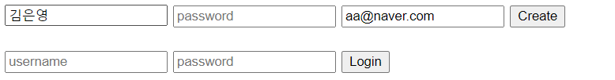
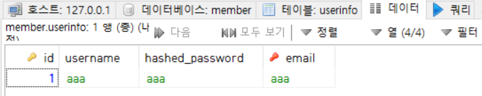

# DATABASE_web

## 0. 웹의 동작 구조


- HTTP(Hyper Text Transfer Protocol) : 인터넷 통신규약
- URL(Uniform Resource Locator) : 인터넷 주소


## 1. 웹 연결

### 1. Pycharm 이용하여 가상 환경에 프로젝트 생성

### 2. Flask 서버 설치

### 3. venv 디렉토리에 `app.py`(서버(Flask) 구동 파이썬 파일) 생성

```python
# 서버(flask) 구동 파일
# 웹서버 구동 명령(flask run) -> flask 서버는 app.py 파일을 찾아서 실행 - 코드에 실행 코드를 찾아서 서버 구동
# 서버 실행 - 터미널 - 명령 : flask run

from flask import Flask, render_template,request,redirect,url_for

# DB #########################################################################
# db 모듈 import
import pymysql

# db 연결 문구
dbconn = pymysql.connect(host='localhost', user='root', passwd='0000', db='member',charset='utf8')
cursor=dbconn.cursor()

# Flask 서버 #########################################################################

# 실행해야 할 서버 명을 설정 - 설정코드가 있으면 서버는 구동

app = Flask(__name__) # 서버이름을 flask에 등록 -> 서버 실행 객체 반환
# front end(user에게 보여질 화면)에 해당(html, css, js 등)하는 파일은 기본설정에는 templates 디렉터리에 저장되어 있어야 함

# 클라이언트가 요청했을 때 기본 응답하는 페이지 설정 (templates-login.html)
@app.route('/', methods=['GET']) # app.route 요청이 오면

def index() : # 요청에 의해 실행될 함수 (반드시 @app.route 뒤에 따라와야 함)
    return render_template('login.html')

@app.route('/register',methods=['POST'])
def register():
    # 사용자 입력값 받아오기 - 사용자(클라이언트)가 서버에게 요청할 때 전달한 값을 받으려면 request 객체 사용
    if request.method == 'POST':
        register_info=request.form # 클라이언트가 요청시 사용한 form의 데이터를 반환
        username=register_info['username'] # 사용자 form에 넘긴 값 중 username 이라는 키 값이 있으면 변수에 입력
        password=register_info['password']
        email=register_info['email']
        print(username,password,email)

        # db에 insert
        sql=""" insert into userInfo(username,hashed_password,email)
        values(%s,%s,%s);
        """
        cursor.execute(sql,(username,password,email))
        dbconn.commit()
        return redirect(url_for(index))
    return render_template('login.html')


@app.route('/login',methods=['POST'])
def login():
    # db에서 select
    if request.method == 'POST' :
        register_info = request.form # 클라이언트가 요청시 사용한 form의 데이터를 반환
        username = register_info['username']
        password = register_info['password']

        sql = "select * from userinfo WHERE username=%s and hashed_password=%s"
        row_count =cursor.execute(sql,(username,password))

        if row_count >0 : # select 된 결과가 있으면
            user_info=cursor.fetchone() # row 객체 가져오기
            print('user_info: ', user_info)
            return render_template('main.html')
        else:
            print('user does not exist')
            redirect(url_for('index'))

    return redirect(url_for('index'))
```

### 4. venv 디렉토리에 `templates` 디렉토리 생성 > `login.html` 파일 넣기

```html
<!DOCTYPE html>
<html lang="en">
<head>
<meta charset="UTF-8">
<title>Loign</title>
</head>
<body>
<div class="login-page">
<form action="/register" method="POST">
<input type="text" placeholder="username" name="username">
<input type="password" placeholder="password" name="password">
<input type="text" placeholder="email address" name="email">
<button type="submit">Create</button>
</form>
<br>
<form action='/login' method="POST">
<input type="text" placeholder="username" name="username">
<input type="password" placeholder="password" name="password">
<button type="submit">Login</button>
</form>
</div>
</body>
</html>
```


### 5. `main.html` 추가하기

```html
# main.html
# 빈 페이지
<!DOCTYPE html>
<html lang="en">
<head>
    <meta charset="UTF-8">
    <title>Title</title>
</head>
<body>

</body>
</html>
```


### 6. `alt+f12`로 터미널 열기 > `flask run` 입력 > URL로 이동

```cmd
(c) 2019 Microsoft Corporation. All rights reserved.

(venv) C:\member>flask run
 * Environment: production
   WARNING: This is a development server. Do not use it in a production deployment.
   Use a production WSGI server instead.
 * Debug mode: off
 * Running on http://127.0.0.1:5000/ (Press CTRL+C to quit)
127.0.0.1 - - [20/Jan/2021 13:31:01] "?[37mGET / HTTP/1.1?[0m" 200 -
```


### 7. 결과

#### 7.1 def register() 





```python
김은영 1234 aa@naver.com # 입력됨
127.0.0.1 - - [20/Jan/2021 14:43:19] "?[32mPOST /register HTTP/1.1?[0m" 302 -
127.0.0.1 - - [20/Jan/2021 14:43:19] "?[31m?[1mGET /register HTTP/1.1?[0m" 405 -
```


#### 7.2 def login() 

```cmd
user_info:  (2, '김은영', '1234', 'aa@naver.com') # 조회됨
127.0.0.1 - - [20/Jan/2021 15:49:20] "?[37mPOST /login HTTP/1.1?[0m" 200 -
```


