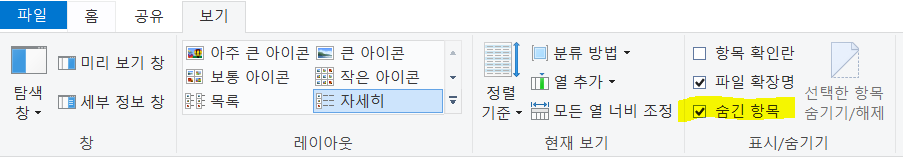
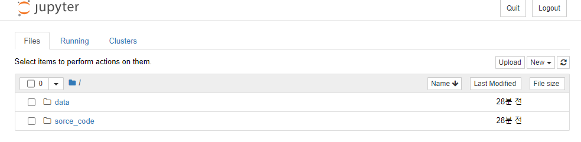

# 파이썬 고급(1)

## 0. 개발 환경 구축

### Anaconda3 설치

* [Anaconda3 다운로드](https://repo.anaconda.com/archive/)
* Python 기반의 데이터 분석에 필요한 오픈소스를 모아놓은 개발 플랫폼

* 가상환경 관리자와 패키지 관리자 제공

* 아나콘다 환경을 웹에서 사용할 수 있도록 연결해주는 웹 서비스

* 아나콘다 내부에 설치되어 있는 패키지들을 웹 브라우저에서 사용 가능

* 웹 브라우저에서 파이썬 코드를 작성하고 실행

* [Chrome](https://www.google.co.kr/chrome/?brand=CHBD&gclid=Cj0KCQiA3NX_BRDQARIsALA3fILh4chwgGObSnO2e4lnXtRhuPTYyBb1TpMaugQgBSWguirZsPrLmD0aArzKEALw_wcB&gclsrc=aw.ds) 웹 브라우저 사용!


### 기본(홈) 디렉토리 변경 방법

0) JupyterNotebook의 홈 디렉터리는 사용자 폴더(`C:\Users\user`)에 생성됨(기본설정)

##### 1) 웹 브라우저와 서버 명령프롬프트 창 종료

##### 2) 홈 디렉터리로 설정할 디렉토리 생성(`C:\DataScience`)

##### 3) 기존에 설정되어 있던 홈 디렉터리 관련 설정 삭제

시작 --> jupyternotebook(우클릭) --> 자세히 --> 파일위치열기 --> jupyternotebook --> 우클릭 --> 속성 --> 바로가기의 대상(T) 입력칸 맨 끝 '`%USERPROFILE%`' 지우기 

##### 4) 노트북 설정파일 생성

4-1) 아나콘다 프롬프트 열기 -->` jupyter notebook --generate-config` 명령어 입력 

```
jupyter notebook --generate-config
Writing default config to: C:\Users\user\.jupyter\jupyter_notebook_config.py 
```

4-2) `C:\Users\user\.jupyter` 폴더 안에 `jupyter_notebook_config.py` 파일 

.jupyter 폴더가 보이지 않는 경우 보기 --> 숨긴 항목 표시 체크



4-3)

pycharm 실행 후  `jupyter_notebook_config.py` 드래그 앤 드랍

Ctrl+F --> `#c.NotebookApp.notebook_dir = ''  ` 찾아 주석 푼 뒤

`c.NotebookApp.notebook_dir = 'C:/DataScience(변경할 경로)'` 으로 변경

4-4) 완료화면




## 1. Jupyter Notebook

### 단축키

#### 셀 선택 mode : `esc` 또는 `Ctrl+m` - 셀 테두리가 파란색

- 위로 셀 추가 : `a`
- 아래로 셀 추가 :  `b`
- 선택 셀 삭제  : `d` `d` - d 두번 누름
- 선택 셀 잘라내기(삭제로 써도 무방) :  `x`
- 선택 셀 복사(Copy) : `c`
- 선택 셀 아래에 붙여넣기(Paste) :  `p`
-  선택 셀과 아래 셀 합치기(merge) :  `shift + m`
- 코드 입력일 때 실행결과 열기/닫기  : `o`

* 해당되는 Code 블럭을 마크다운으로 변경 : `m`
* 해당되는 마크다운 블럭을 코드로 변경 : `y`
* 저장 :  `Ctrl + s` 또는 `s`
* 선택 셀의 코드 입력 모드로 전환 : `Enter`


#### 코드 입력 모드 (Edit Mode) :`enter` - 셀 테두리가 초록색

* 편집셀의 코드 전체 선택 :  `Ctrl + a`
* 편집셀 내 실행 취소 : `Ctrl + y`
* 편집셀 내 다시 실행 : `Ctrl + v`
* 커서 위치한 라인 주석 처리/해제 : `Ctrl + /`
* 편집 중인 셀 코드를 실행 `Ctrl + Enter`
* 편집 중인 셀 코드 실행 후 다음 셀로 이동(다음 셀이 없으면 새로 추가) : `Shift + Enter`
* 코드 실행  :  `Ctrl + Enter`
* 커서 위치에서 셀 둘로 나누기 : `Shift + Ctrl +  -(마이너스)`ㅓ
* 셀 선택 모드로 돌아가기 : `esc` 또는 `Ctrl + m`


### 커널 메뉴(Kernel)

* Restart & Run All : 존재하는 모든 코드 블록 실행

## 2. Pandas

>Series, DataFrame 등의 자료구조를 활용한 데이터 분석과 관련된 기능을 제공해주는 라이브러리

### Pandas 라이브러리 구성

* 여러종류의 기능을 구현한 클래스와 내장함수로 구성
* series, DataFrame 이라는 구조 표현 클래스 객체
* 자주 사용되는 내장함수 : Series(), DataFrame(), read_csv(), read_excel() 등


### Series VS DataFrame

* Series : 1차원 배열
* DataFrame : 2차원 배열


### pandas 사용 목적

* 서로 다른 여러가지 유형의 데이터를 공통의 포맷으로 정리하는 것
* 데이터 프레임을 분석실무에서 자주 사용


#### 사용하려면 import 해야 함


## 3. Pandas_시리즈

>데이터가 순차적으로 나열된 1차원 배열의 형태로 인덱스와 데이터값이 일대일로 대응
>
>딕셔너리와 비슷한 구조


### 시리즈의 인덱스

데이터 값의 위치를 나타내는 이름표(데이터 주소) 역할

예로 index2 라는 주소를 알고 있다면 data2라는 원소 데이터 값에 바로 접근 가능


### 시리즈 인덱싱

> 데이터에서 특정한 세부 데이터만 접근해서 값을 반환 받는 것

#### 시리즈 인덱싱의 종류

* 정수형 위치 인덱스
* 인덱스 이름 또는 인덱스 라벨(문자형 인덱스)
* 인덱스를 별도로 정의하지 않으면 0부터 시작하는 디폴트 정수형 위치 인딕스가 자동 지정
* 원소 선택 : 인덱스를 이용, 객체명[인덱스]


### 시리즈 생성: series() 함수 사용

>  리스트, 딕셔너리, 튜플 형태의 데이터를 구성 후 Series()

#### 리스트 이용해서 시리즈 만들기

```python
import pandas as pd
import numpy as np
s=pd.Series([1,2,3])
s # 인덱스 :  0부터 시작하는 정수값으로 자동 지정

# 결측값 포함해서 시리즈 만들기
# numpy 패키지의 nan 이라는 내부 변수는 결측값을 표현함(np.nan)
s=pd.Series([1,3,5,nan,6,8])
s
>>>
0    1.0
1    3.0
2    5.0
3    NaN
4    6.0
5    8.0
dtype: float64
```


#### 시리즈 인덱스 지정

```python
# 숫자 인덱스 지정
# index=[]
s=pd.Series([10,20,30], index=[1,2,3])
s
>>>
1    10
2    20
3    30
dtype: int64
```

```python
# 문자 인덱스 지정
s=pd.Series([90,100,88], index=['홍길동','이몽룡','성춘향'])
s
>>>
홍길동     90
이몽룡    100
성춘향     88
dtype: int64
```

```python
# 문자 인덱스 지정 2
s=pd.Series([994312,3448747,2890451,2466052], index=['서울','부산','인천','대구'])
s
>>>
서울     994312
부산    3448747
인천    2890451
대구    2466052
dtype: int64
```

```python
# range() 함수로 시리즈 만들기
pd.Series(range(10,14))
>>>
0    10
1    11
2    12
3    13
dtype: int64
```


#### 시리즈 인덱스, 값 확인

* Series 클래스 안에 index 라는 변수가 만들어져 있음

- index 속성을 이용해서 관련 index 확인 가능
- 시리즈 객체명.index로 확인 가능

```python
s.index
>>>
Index(['서울', '부산', '인천', '대구'], dtype='object')
```

```python
s.values # Type : array 
>>>
array([ 994312, 3448747, 2890451, 2466052], dtype=int64)
```


#### 시리즈 이름 붙이기

- name 속성을 이용하여 시리즈 데이터에 이름을 붙일 수 있음


```python
s.name='인구'
s
>>>
서울     994312
부산    3448747
인천    2890451
대구    2466052
Name: 인구, dtype: int64
```


#### 시리즈 인덱싱

> 데이터에서 특정한 세부 데이터만 접근해서 값을 반환 받는 것


##### 시리즈 인덱싱 종류별 접근법

* ##### 정수형 위치 인덱스

  > 인덱스를 별도로 정의하지 않으면 0부터 시작하는 디폴트 정수형 위치 인딕스가 자동 지정

  ```python
  # 정수형 위치 인덱스를 사용한 인덱싱
  # 시리즈는 순차적 의미를 갖고 있기 때문에 라벨형 인덱스가 있어도 위치 인덱스 사용 가능
  s[0]
  >>>
  994312
  ```

  

* ##### 인덱스 이름 

  >  인덱스에도 이름을 붙일 수 있음

  ```python
  # 인덱스에도 이름을 붙일 수 있음
  객체.index.name='인덱스 이름'
  
  s.index.name='도시'
  s
  >>>
  도시
  서울     994312
  부산    3448747
  인천    2890451
  대구    2466052
  Name: 인구, dtype: int64
  ```

  

* ##### 인덱스 라벨(문자형 인덱스)

  > 문자형 인덱스를 라벨이라고 함. 인덱스와 같은 기능

  ```python
  s0=pd.Series(range(3), index=['apple','banana','pine'])
  s0
  >>>
  apple     0
  banana    1
  pine      2
  dtype: int64
  
  # 라벨형 인덱스 설정 한 경우, 라벨을 이용해서도 접근 가능
  # 라벨값이 영문 문자열인 경우 마치 속성인것처럼 .을 이용하여 접근 가능
  # 한글 문자열은 이와 같은 접근을 권장하지 않음
  print(s0.apple)
  print(s0['apple'])
  print(s0[0])
  >>>
  0
  0
  0
  ```

  

  ##### 여러 값 인덱싱

  ```python
  # 인덱싱을 값 하나가 아닌 여러 값으로 할 수 있음
  # 리스트형 인덱싱을 하면 자료의 순서를 바꾸거나 특정한 자료만 선택할 수 있다.
  s[[0,3,1]]
  >>>
  도시
  서울     994312
  부산    3448747
  인천    2890451
  대구    2466052
  Name: 인구, dtype: int64
  ```

  

  ##### 리스트형 인덱싱 타입

  ```python
  # 리스트형 인덱싱을 했을 때 반환 결과의 타입 확인 : 시리즈 구조
  # 하나의 요소 인덱싱을 했을 때 반환 결과의 타입 확인 : 접근한 value의 타입으로 반환
  type(s[[0]])
  s[[0]]
  >>>
  도시
  서울    994312
  Name: 인구, dtype: int64
  ```

  

  ##### 인덱스 라벨 사용 순서 변경

  ```python
  # 인덱스 라벨을 사용하여 특정 자료의 집합을 선택(순서 변경)
  s[['서울','대구','부산']]
  >>>
  도시
  서울     994312
  대구    2466052
  부산    3448747
  Name: 인구, dtype: int64
  ```

  

  ##### 슬라이싱 이용한 인덱싱

  ```python
  # 슬라이싱을 이용한 인덱싱
  # 정수형 위치 인덱스를 사용한 슬라이싱
  s[1:3] 
  >>>
  도시
  부산    3448747
  인천    2890451
  Name: 인구, dtype: int64
          
  # 인덱스 라벨을 사용한 슬라이싱
  s['부산':'대구'] # 부산 ~ 대구까지 추출
  >>>
  도시
  부산    3448747
  인천    2890451
  대구    2466052
  Name: 인구, dtype: int64
  ```


#### 시리즈와 딕셔너리 자료형


* 시리즈 객체는 라벨값에 의해 인덱싱이 가능하므로 실질적으로 라벨 값을 키(key)로 가지는 딕셔너리 자료형과 같다고 볼 수 있다.
* 따라서 딕셔너리 자료형에서 제공하는 in 연산도 가능하고 items 메서드를 사용하면 for 루프를 통해 각 원소의 키와 값을 접근할 수도 있다.

##### in 연산

```python
'서울' in s
>>>
True

'대전' in s
>>>
False
```


##### for문 사용하여 Series.items() 키, 값 출력하기

```python
s.items()
>>>
<zip at 0x1d2e8eeb248> # zip 타입임에 유의!

for data in s.items():
    print(data)
>>>
('서울', 994312)
('부산', 3448747)
('인천', 2890451)
('대구', 2466052)


s.items()
k,v=(1,2)
for k,v in s.items():
    print('%s =%d'%(k,v))
>>>
서울 =994312
부산 =3448747
인천 =2890451
대구 =2466052
```


##### 딕셔너리로 시리즈 만들기

- 딕셔너리와 시리즈의 구조가 비슷 > 딕셔너리를 시리즈로 변환하는 방법 많이 사용
- Series()로 만들고 딕셔너리를 함수의 인자로 전달
- 딕셔너리의 key는 시리즈의 인덱스에 대응되고 딕셔너리의 value는 시리즈의 데이터 값으로 변환

```python
# 딕셔너리로 시리즈 만들기
scores={'홍길동':95,'이몽룡':100,'성춘향':88}
s=pd.Series(scores)
s
>>>
홍길동     95
이몽룡    100
성춘향     88
dtype: int64
```

```python
# 위쪽에서 생성된 도시의 리스트를 참고하여 딕셔너리로 구성하고
# 해당 딕셔너리를 시리즈 s2로 만드시오
# 딕셔너리의 원소는 순서를 가지지 않으므로 순서를 정하고 싶다면 인덱스를 리스트로 
# 지정해야 한다
s2=pd.Series({'서울':994312,'부산':3448747,'인천':2890451,'대구':2466052},
            index=['부산','서울','인천','대구'])
s2
>>>
부산    3448747
서울     994312
인천    2890451
대구    2466052
dtype: int64
    
    
s2[0]
3448747
```


#### 시리즈 데이터의 갱신, 추가, 삭제

> 딕셔너리 인덱싱을 이용하면 데이터를 갱신하거나 추가할 수 있다

##### 데이터 갱신

```python
# s2 시리즈의 부산 데이터 갱신
s2['부산']=1630000
s2
>>>
부산    1630000
서울     994312
인천    2890451
대구    2466052
dtype: int64
```


##### 데이터 추가

```python
# 새로운 데이터 추가(있으면 수정 없으면 추가)
s2['울산']=900000
s2
>>>
부산    1630000
서울     994312
인천    2890451
대구    2466052
울산     900000
dtype: int64
```


##### 데이터 삭제

```python
# 데이터 삭제
del s2['서울'] # s2['서울']=None
s2
>>>
부산    1630000
인천    2890451
대구    2466052
울산     900000
dtype: int64
```


##### 예제) 리스트, 딕셔너리 받아 시리즈 생성하기

```python
## 연습문제
# 임의로 두 개의 시리즈 객체를 만든다
# 첫번째 리스트는 리스트, 두번째 시리즈는 딕셔너리 이용
# 두 객체 모두 문자열 인덱스를 가져야 함. 두 시리즈에 공통적으로 포함하지 않는 라벨이 있어야 한다.

s3=pd.Series(['1','2','3'], index=['곰','개','고양이'])
s3.name='동물'
s3
s4=pd.Series({'4':'딸기','5':'포도','6':'참외'}, index=['5','6','4'])
s4.name='과일'
s4
```


## 4.Pandas_데이터프레임

- 2차원 행렬 데이터에 인덱스를 붙인 것

- 행과 열로 만들어지는 2차원 배열 구조

- R의 데이터 프레임에서 유래

- 데이터 프레임의 열은 각각 시리즈 객체로 이루어져 있음

- DataFrame() 함수를 사용하여 데이터 프레임 생성

- ##### 리스트 요소 수=행, 리스트 개수(시리즈 개수)=열, 딕셔너리로 열의 이름 넘겨줌

### 데이터 프레임 생성

#### 리스트로 데이터 프레임 생성1

```python
# 리스트로 데이터 프레임 만들기
df = pd.DataFrame(['a','b','c'])
df
>>>

0
0	a
1	b
2	c
```


#### 리스트로 데이터 프레임 생성2

```python
# 리스트로 데이터 프레임 만들기 2
# df는 행이름 열이름이 반드시 있어야 하기 때문에 설정하지 않으면 자동 생성됨
df=pd.DataFrame([['a','b','c'],['a','a','g'],['a','i','j']]) # 각 리스트(행)를 한 덩어리로 넘겨줘야 함
df
>>>

0	1	2
0	a	b	c
1	a	a	g
2	a	i	j
```


#### 딕셔너리로 열 이름 넘겨주기

```python
# 열 인덱스와 행 인데스를 직접 설정해서 df 생성
# dict key가 열 이름
# index=매개변수는 행 이름
df=pd.DataFrame({'A':['a','b','c'],
                'B':['a','a','g'],
                'C':['a','i','j']},
               index=[0,1,2])
df
>>>
A	B	C
0	a	a	a
1	b	a	i
2	c	g	j
```


