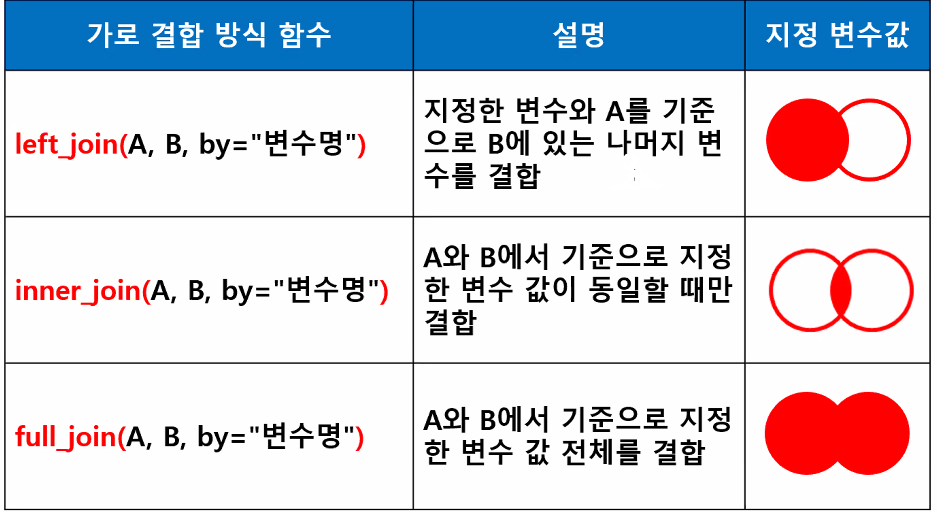
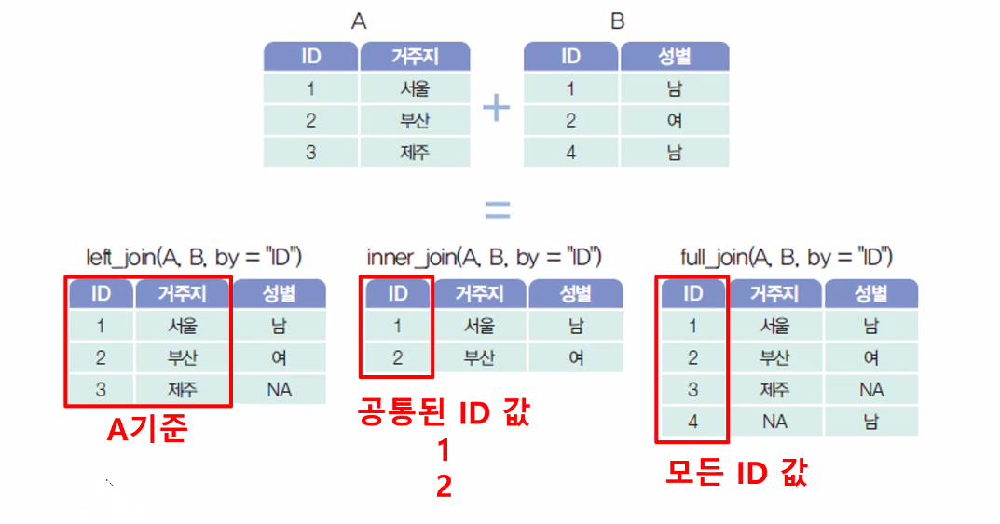
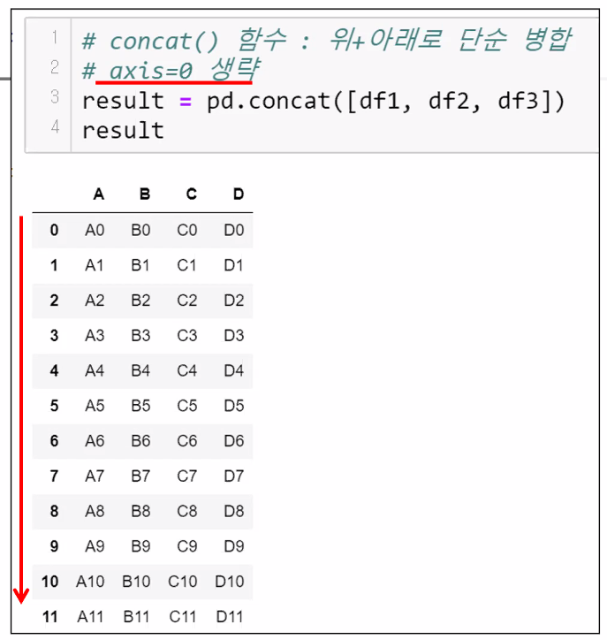
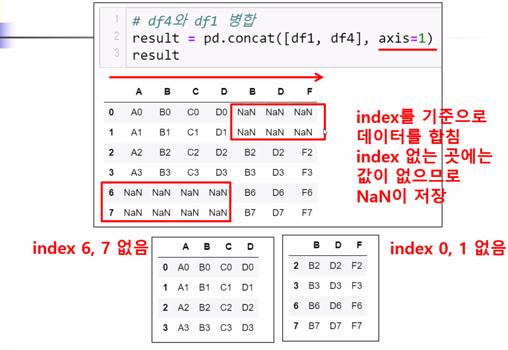

# 파이썬 고급(2)

> 인덱스 설정 함수, 리스트 내포 for문(노트 1-3), 데이터 결합(노트1-4)

## 기본설정

```python
import numpy as np
import pandas as pd
import random

# 설정변경코드
# 변수병이 두번 이상 출력되어도 모두 콘솔에서 보여줄 것
from IPython.core.interactiveshell import InteractiveShell
InteractiveShell.ast_node_interactivity="all"
```


## 인덱스 설정 함수(추가) 

데이터 프레임 인덱스 설정을 위해 set_index(), reset_index()

* set_index() : 기존 행 인덱스를 제거하고 데이터 열 중 하나를 인덱스로 설정
* reset_index(): 기존 행 인덱스를 제거하고 기본 인덱스로 변경
* 기본 인덱스: 0부터 1까지 증가하는 정수 인덱스
  * 따로 설정하지 않으면 기존 인덱스는 데이터 열로 추가 됨

```python
#예제 데이터프레임 생성
df3 = pd.DataFrame({
    'a':[1,3,4,3,4],
    'b':[2,3,1,4,5],
    'c':[1,5,2,4,4]
})
df3

df3=df3.set_index('a')
df3

df3=df3.reset_index()
df3
```

```python
# df3 데이터 프레임의 행 인덱스를 제거하고 기본 인덱스로 설정하시오.
# df3에 반영하시오(단 원 인덱스를 삭제)
df3=df3.reset_index(drop=True)
df3

# index 이름 바꾸기(행 인덱스)
# rename()
# df.rename(index={현재 인덱스:바꿀인덱스})
df3=df3.rename(index={0:1})
df3

# 열 이름 바꾸기
df3.rename(columns={'b':'학생'})
```


### 리스트 내포 for 문

``` python
a=[1,2,3,4]
# a 리스트의 각 원소에 2배한 원소값을 만들고 리스트로 저장.
# 반복문 사용
result=[2,4,6,8]
result=[]
for num in a :
    result.append(num*2)
result

# 리스트 내포 for 문
result=[num*2 for num in a]
result
>>>
[2, 4, 6, 8]
[2, 4, 6, 8]
```


#### 연습문제

```python
# 연습문제
# id['id_1','id_2',...] 
# 요소 내포 for 문 사용해 생성후 리스트로 추가
['id_'+str(i) for i in range(1,5)]
['id_'+str(i) for i in range(1,5)]*2
```


## 데이터 합치기

> 두개 이상의 df를 하나로 합치는 병합(merge,) 연결(concate)






### merge()

* df1.merge(df2,how=병합방식) : 두 df 병합
* 기본은 inner join : 양쪽에 동일하게 존재하는 키 표시
* key : 기준열
  * 실제 데이터 필드이거나 행 인덱스
* inner join how=inner(생략가능)
* outer join :한 쪽에만 키가 존재하면 data 표시 how=outer


```python
# inner join
# merge 명령으로 두 df를 병합하는 문법
# 모든 인수 생략(병합 df 제외) - 공통이름을 갖고있는 열이 존재
# '고객번호' 공통이름 필드가 있음 - key로 설정
# 양쪽에 모두 존재하는 key의 데이터만 보여주는 inner join 방식 사용
# 공통 필드 존재 확인 
df1.head(1)
df2.head(1)
df1.merge(df2) # 기준이 되는 df 객체의 메서드 사용
pd.merge(df1,df2) # 기준 df을 왼쪽에 둔다
```


### concat()





