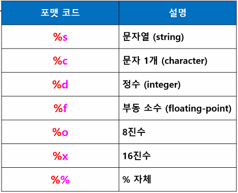
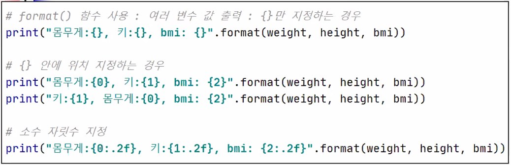
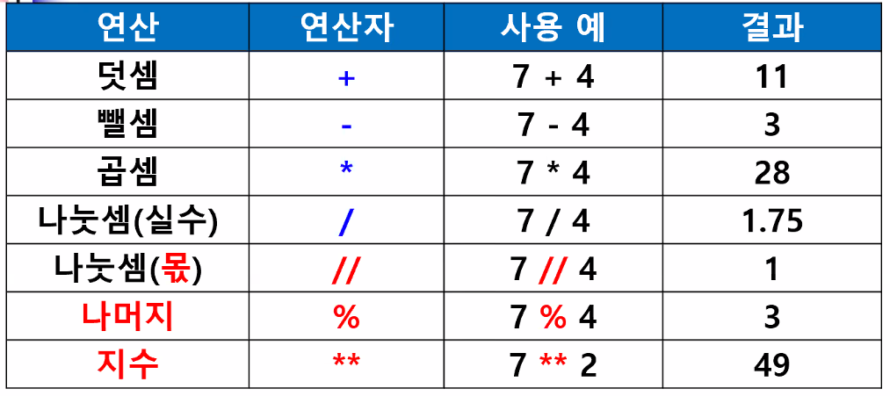
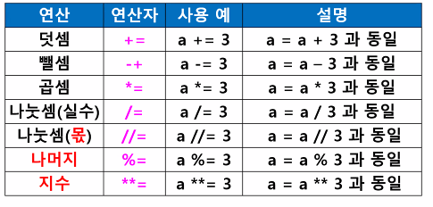
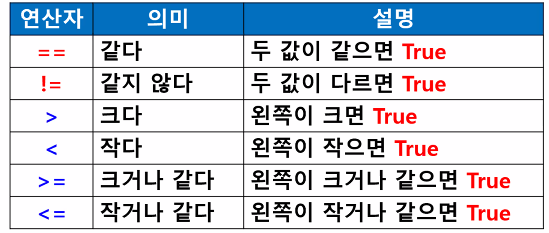
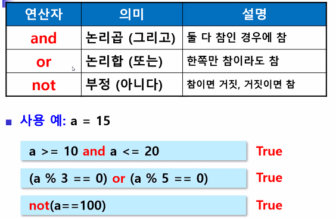
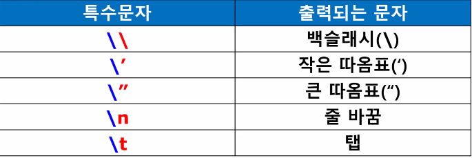

# 파이썬 기초(1)

> 변수, 포맷코드, 연산자, 상수, 리터럴, 주석, 행분리, 이스케이프


## 0.  파이썬

   * 인터프리터 언어, 스크립트 언어 : 명령코드를 한 줄씩 해석해서 바로 실행 => 컴파일 언어(한 번에 다 해석 후 실행, C, JAVA)에 비해 실행 속도 느림
   * 위쪽으로 실행을 다시 되돌릴 수 없음
   * 범용 프로그래밍 언어
   * 써드 파티 라이브러리 사용 가능
   * 다른 언어와 호환성이 좋아 유연함
* 모바일 컴퓨팅 분야 지원 약함


##  1. 파이썬 개발환경 구축

   > Pycharm(InteliJ), Pydev(이클립스 플러그인), ipython notebook(웹브라우저)

   * [파이썬 설치 사이트](http://www.python.orgpython) 
   * Download Ver 3.7.9 [Windows x86-64 executable installer](https://www.python.org/ftp/python/3.7.9/python-3.7.9-amd64.exe)
     * python to path 체크!
   * IDLE : 간단한 편집기
   * 파이참 설치


## 2. 파이참

* [Pycharm](https://www.jetbrains.com/ko-kr/pycharm/download/#section=windows)
* 파이썬 콘솔 : 연산식은 바로 결과를 출력해줌


## 3. 변수

> 컴퓨터가 실행중에 필요한 데이터를 저장하는 공간
### Python의 변수

* 변수 선언 필요 없음(선언과 저장이 동시에 일어남)
* 동적 타이핑 : 변수에 저장된 값의 형에 따라 실행 도중(대입연산자가 동작할 때마다)에 동적으로 type 검사


### 변수값, 주소값

```python
x=10
print('x',x) #x변수가 참조하는 주소의 값 출력
print('x id',id(x)) #x변수가 참조하는 주소 출력

>>
x 10
x id 140728628903264
```

```python
x=10 #변수 선언(생성) 및 저장 - 정수형 변수로 생성
print(x) #x변수가 참조하는 주소에 저장된 값을 출력
print(id(x)) #x변수가 참조하는 주소를 출력
print(type(x)) #x변수의 형태(저장된 값의 형태)를 출력
x=7.5 #변수 x의 값을 7.5로 변경(형태도 실수로 변경)
print(type(x)) #변경된 실수 형태로 출력

>>>
x 10
x id 140728628903264
10
140728628903264
<class 'int'>
<class 'float'>
```

* 실행중에 계속 교체 가능 ex. 변수명=값

* 문자, 숫자, 다른 변수의 값 저장 가능

* x = 10 > 변수 x에 실제 객체(값)이 들어가는 것이 아니라, 객체(값)의 주소값 저장

  * 값은 메모리 어딘가에 저장

* id(x) : x가 가리키는 메모리의 주소 반환

* 파이썬 변수는 참조형 변수

  

### 변수값 저장

```python
#한 개의 변수에 한 개의 값 저장
result=10

#여러개의 변수에 여러개의 값 저장
#왼쪽 항의 변수의 개수와 오른쪽 항의 값의 개수가 일치해야 함
a,b,c=1,2,3
print(a)
print(b)
print(c)

#여러개의 변수에 동일한 한 개의 값 저장
#변수1=변수2=변수3=변수4
#c>b>a 순으로 값이 저장됨
a=b=c=10

print(a)
print(b)
print(c)

>>>
1
2
3
10
10
10
```

```python
#두 변수의 값 교환(swap)
#a 변수에 있는 값을 b변수에 저장, b변수에 있는 값을 a변수에 저장
#변수1,변수2=변수2,변수1
a,b= 10,20
print(a,b)

#a변수값과 b변수값을 서로 교환하는 코드
a,b=b,a
print(a,b)

>>>
10 20
20 10
```


### 변수 삭제

```python
#변수 삭제 : del 명령어 사용
#del 삭제할 변수
c=100
print(c)
del c
print(c)#에러발생

>>>
Traceback (most recent call last):
  File "C:/Python_study/ch3/변수/변수1.py", line 4, in <module>
    print(c)
NameError: name 'c' is not defined
100
```


### 변수명

* 대소문자 구분

* 영문자, 숫자, 밑줄( _ )로 구성

* 중간 공백 허용X

* 중간에 대문자(낙타체)로 시작 ex.stdName

* 이미 용도가 정해져 있는 단어(예약어)는 사용 불가

* 식별자 : 변수, 상수, 함수, 사용자 정의 타입 등에서 다른 것과 구분하기 위해 사용되는 이름


```python
#예약어 출력
import keyword
print(keyword.kwlist)

>>>
['False', 'None', 'True', 'and', 'as', 'assert', 'async', 'await', 'break', 'class', 'continue', 'def', 'del', 'elif', 'else', 'except', 'finally', 'for', 'from', 'global', 'if', 'import', 'in', 'is', 'lambda', 'nonlocal', 'not', 'or', 'pass', 'raise', 'return', 'try', 'while', 'with', 'yield']
```


### 변수 출력

```python
name = "홍길동"
age = 23
print(name + '은 '+ age + '살 입니다.')

>>>
Traceback (most recent call last):
  File "C:/Python_study/ch3/변수/변수3.py", line 9, in <module>
    print(name + '은 '+ age + '살 입니다.')
TypeError: can only concatenate str (not "int") to str
```

* 형변환 오류

* concatenate 시도할때는 서로 같은 형이어야 함

  #### 오류해결방법

  ```python
  print(name + '은 ', age, '살 입니다.')
  print(name + '은 '+ str(age) + '살 입니다.') #정수값을 print 문에서만 일회성으로 문자로 변경하는 작업
  
  >>>
  홍길동은  23 살 입니다.
  홍길동은 23살 입니다.
  ```


### 포맷 코드 사용



```python
name='홍길동'
no=2016001
year=4
grade='A'
ave=93.5

print('성명 : %s\n학번 : %d\n학년 : %d\n학점 : %c\n평균 : %.2f' % (name, no, year, grade, ave))

>>>
성명 : 홍길동
학번 : 2016001
학년 : 4
학점 : A
평균 : 93.50
```

* `%f` 소수점 밑 n자리까지 출력 

  ```python
  #화씨 > 섭씨 온도 변환
  fTemp=90
  cTemp=(fTemp-32)*5/9
  print(cTemp)
  print('%f'%cTemp)#소수점 이하 6자리 까지 출력
  print('%.2f'%cTemp)#소수점 이하 2자리 까지 출력
  
  #print문 안에 format() 함수를 사용해서 소수점 이하 자릿수를 설정
  #format(실수, '전체자릿수, 소수 이하 자릿수.%f'
  print(format(cTemp,'3.3f'))
  
  #전체 10자리(소수점이하 2자리 포함)
  print(format(cTemp,'10.2f')) #소수점 포함하여 10자리 출력(앞에서부터 공백문자 출력)
  ```

* `%` 문자열 출력

  ```python
  rate = 80
  print('출석률 : %d%%' % rate) #%%로 코딩하면 % 문자 자체 의미
  
  >>>
  출석률 : 80%
  ```

* 두 개 이상의 값을 출력할 때

  ```python
  #print('%d %f' % (정수값, 실수값)) 
  #반드시 괄호로 묶는다! 괄호 없을시 오류
  total =250
  ave=83.33
  print('%d %.2f'%(total,ave))
  ```


### 포맷 함수 이용하여 구분기호 사용

```python
INT_RATE=0.03

deposit=10000
interest=deposit * INT_RATE
balance=deposit+interest
print(format(int(balance), ','))

>>>
10,300
```




### 상수

> 값이 변경되지 않는 저장공간

* 파이썬에서는 별도의 상수가 없다
* 변수와 구분하기 위해 이름을 전부 대문자로 사용
* 나중에 상수 값을 변경해도 오류 없음

```python
#원 넓이 계산
PI=3.1415
r=10
area=r**2*PI
print(area)

#이자 계산
INT_RATE=0.03

deposit=10000
interest=deposit * INT_RATE
balance=deposit+interest

print(balance)
print(int(balance)) #정수형으로 변환

>>>
314.15000000000003
10300.0
10300
```


### 리터럴

> 고정된 값, 변수에 저장되는 값
>
> 정수, 논리, 문자 리터럴...

 ```python
a=0b1010 #2진수 리터럴 저장(0b)
b=0o123 #8진수(0o)
c=300 #10진수
d=0x12fc #16진수(0x)
  
print(a,b,c,d) #진수로 변환해서 출력

>>>
10 83 300 4860 
 ```

* 정수 리터럴 : 2진수(0b로 시작) 8진수(0o로 시작) 10진수(0~9로 시작) 16진수

* 실수 리터럴: 고정 소수법으로 표기 1.23e2 > 123

  ```python
  f=1.234567e5
  print(f)
  
  >>>
  123456.7
  ```

* 문자 리터럴: '', ""로 묶은 값

* 문자열 리터럴: '', "" , ''' ''' 로 묶은 값

  ```python
  str4='제 이름은'\ #
       '홍길동 입니다.'
  
  str5='''여러줄로
  나누어서
  출력해도 됨'''
  
  """여러줄로
  나누어서
  출력해도 됨"""
  
  print(str4)
  print(str5)
  
  >>>
  제 이름은홍길동 입니다.
  여러줄로
  나누어서
  출력해도 됨
  여러줄로
  나누어서
  출력해도 됨
  ```

  * `\`밑에 줄과 연결해주는 기호
  * ''' ''', """ """ 의 경우 줄바꿈 포함하여 문자열 출력 가능
  * ''' ''' 여러줄 주석을 처리할 때 사용

* 논리값 리터럴: 부울값 

  ```python
  t = TRUE
  f = FALSE
  ```

* 특수 리터럴: None 값

  ```python
  name='홍길동'
  phone=None
  
  print(name,phone)
  print(type(name),type(phone))
  
  >>>
  홍길동 None
  <class 'str'> <class 'NoneType'>
  ```

  * 어떤 타입도 결정해 놓지 않은 상태인 `NoneType`으로 지정 가능


## 4.연산자

### 산술 연산자



* 실수는 정수보다 공간이 큼
* 서로 다른 변수끼리 산술 연산시 결과값은 공간이 더 큰 쪽의 형태를 따라감. ex.실수 * 정수 계산은 실수로 계산됨
* 우선순위 : 괄호 > 지수 > 곱셈, 나눗셈(%, //, /) > +, - > 대입연산자(=) 
  * 연산자 우선순위가 같은 경우 왼쪽 > 오른쪽으로 우선순위 정해짐

```python
sec=10000
hour=sec//3600 
remainder=sec%3600 #hour로 나누고 남은 초
min=(remainder)//60 
re_sec=(remainder)%60 #min으로 나누고 남은 초

print('%d시간 %d분 %d초' % (hour,min,re_sec))

>> 2시간 46분 40초
```


### 누적대입연산자




### 관계 연산자



* 두 값을 비교하여 결과 반환

* 결과는 True(1) / False(0)

* 대입연산자보다 우선순위

  

### 논리 연산자



* 관계 연산자와 같이 사용하는 것이 일반적

  

### 비트 연산자


## 5. 주석

* 한 줄 주석 : #주석내용
* 여러줄 주석 : '''주석내용''' 
  * pycharm에서는 블럭을 드래그 한 뒤 `Ctrl+/` 하면 해당 부분 전체 주석처리/해제 가능


## 6. 행분리, 결합

### 행분리

* 역슬래시(`\`) 사용 

* 괄호() 사용

  ```python
  a = 1+2+3+\
      4+5+6
  b = (1+2+3+
       4+5+6)
  
  print(a,b)
  
  >>>
  21 21
  ```

* print() 행분리

  ```python
  print('dididi'
        '뱌보야'
        '야야야')
  
  >>>
  dididi뱌보야야야야
  ```

* print() 이스케이프 문자`\n` 사용한 강제 행분리 

  ```
  print('dididi\n'
        '뱌보야\n'
        '야야야')
  
  >>>
  dididi
  뱌보야
  야야야
  ```

### 행결합

```python
print('AAAA'); print('BBBB')

>>>
AAAA
BBBB
```

```
#옆으로 출력
print('first', end="")
print('second')

print('first', end=" ")
print('second')

print('first', end="/")
print('second')

#end 옵션값으로 구분자 표시 : 띄어쓰기, 쉼표, 대시, 콜론,...

>>>
firstsecond
first second
first/second
```

### 7. 이스케이프 문자



```python
#'를 문자열로 출력
word = 'doesn\'t'
word2 = "doesn\'t" #'," 혼합해서 사용 가능
print(word)
print(word2)

>>>
doesn't
doesn't
```

* 파일 경로 출력하거나 저장할 때

  ```
  #row 버전의 시스템 문자로 처리 - 첫번째 따옴표 앞에 r 추가
  print(r"c:\info\name")
  
  >>>
  c:\info\name
  ```

  