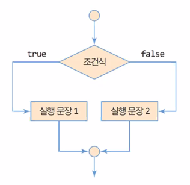
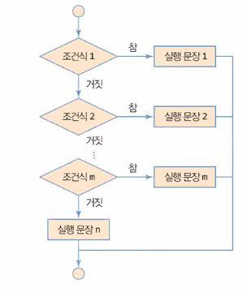
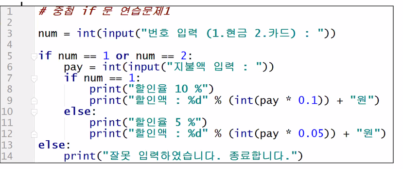
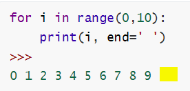

# 파이썬 기초(2)

> 자료형 데이터 타입

## 0. 파이썬이 처리하는 자료형

> 가변 자료형 : 파이썬에서 변수는 지정된 자료형이 없음
>
> 동적 타이핑 : 저장한 값에 따라 변수의 자료형이 정해짐

* 정수(int) : ..., -1, 0, 10,...
* 실수(float) : 3.14
* 문자열(str) : '홍길동', "A", '123'
* 부울(bool) : True, False

* 자료형을 확인하는 명령어 `type( )`

  ```python
  num=100
  print('num : ', type(num))
  
  PI=3.14
  print('PI : ', type(PI))
  
  name='홍길동'
  print('name : ', type(name))
  
  done=True
  print('done : ', type(done))
  >>>
  num :  <class 'int'>
  PI :  <class 'float'>
  name :  <class 'str'>
  done :  <class 'bool'>
  ```


## 1. 형변환 함수

> 다른 자료형을 지정된 자료형으로 일회성으로 변환시켜주는 함수

```python
a=100
print(float(a))
print(type(a))
>>>
100.0
<class 'int'>
```

* 형변환 함수를 사용한다고 해서 변수의 형이 영구적으로 변환되는 것이 아님
* `type()` 함수는 형을 일회적으로 변환시켜서 그 값을 반환하는 함수

### int() 함수

```python
print(int(123.12))
print(int(123.99))
>>>
123
123
```

* 십진수 형태가 아닌 것을 `int()` 명령을 사용하여 변환할 시 오류

  ```python
  print(int('abc'))
  >>>
      print(int('abc'))
  ValueError: invalid literal for int() with base 10: 'abc'
  ```


### float() 함수 

> 문자열 및 정수형을 실수로 변환

```python
print(float(100))
print(float('100.123'))
print(float('100'))
>>>
100.0
100.123
100.0
```


### str() 함수 

```
print(type(str(100)))
>>>
<class 'str'>
```


### eval() 함수

```python
print(eval('123.1'))
print(eval('123'))
print(eval('123.1'))

a=eval(input("수식입력 : "))
print(a)
print(type(a))
>>>
123.1
123
123.1
수식입력 : 3+5
8
<class 'int'>
```


## 2. input() 함수

> 키보드로부터 입력받은 값을 반환하는 함수

* 사용자가 키보드로 값을 입력하면 입력한 값은 무조건 문자열로 처리됨

  ```python
  name=input('이름입력 : ')
  age=input('나이입력 : ')
  print('이름 : ' + name + '나이 : ' + age)
  print(type(name), type(age))
  >>>
  이름입력 : 홍길동
  나이입력 : 25
  이름 : 홍길동나이 : 25
  <class 'str'> <class 'str'>
  ```

* 따라서 입력값에 대한 형변환이 필요함
   ```python
   su=input('수 1을 입력하세요 : ')
   print(su+10)
   >>>
     print(su+10)
   TypeError: can only concatenate str (not 'int') to   str
   ```
  ```python
  #input에서 변환
  su=int(input('수 1을 입력하세요 : '))
  print(su+10)
  
  #print에서 변환
  su=input('수 1을 입력하세요 : ')
  print(int(su)+10)
  >>>
  수 1을 입력하세요 : 100
  110
  수 1을 입력하세요: 100
  110
  ```
  
  ```python
  n1=input("숫자1 입력 : ")
  n2=input("숫자2 입력 : ")
  sum=n1+n2
  print('합 : ', sum)
  
  n1=int(input("숫자1 입력 : "))
  n2=int(input("숫자2 입력 : "))
  sum=n1+n2
  print('합 : ', sum)
  >>>
  숫자1 입력 : 10
  숫자2 입력 : 20
  합 :  1020
  숫자1 입력 : 10
  숫자2 입력 : 20
  합 :  30
  ```


## 3. 제어문

> 프로그램의 흐름을 제어
>
> 코드의 실행 흐름을 개발자가 원하는 방향으로 변경할 수 있도록 도와줌

##### Tip)`tab`, `shift+tab` 으로 들여쓰기를 넣고 빼기 가능

### 조건문(선택문) (if, if_else, elif, 중첩if)

* if

  ```python
  if(조건식):
      참일 경우 수행되는 문장 
  ```

  * 조건식이 참이면 주어진 문장 수행

  * 조건식이 거짓이면 아무것도 수행하지 않음

  * 들여쓰기 주의(`Tab` 이용)

    

* if else

  

  ```python
  if(조건식):
      참일 경우 수행되는 문장
  else :
      거짓일 경우 수행되는 문장
  ```

  * 조건식이 참이면 if 문 수행
  * 조건식이 거짓이면 else 문 수행

  ##### 예제 1)

  ```python
  passsave=1234
  password = int(input('비밀번호를 입력해주세요 : '))
  if Password == passsave:
      print('비밀번호가 일치합니다.')
  else:
      print('비밀번호가 틀립니다.')
  >>>
  비밀번호를 입력해주세요 : 123
  비밀번호가 틀립니다.
  ```

  
  
  ##### 예제 2)
  
  ```python
  passsave=1234
  PW = int(input('비밀번호를 입력해주세요 : '))
  if PW != passsave:
      print('불일치')
  else:
      pass #어떤 작업도 수행하지 않고 문장을 종료함.
            #값이 일치해서 else 구문으로 왔을 경우
  print('확인 종료')
  >>>
  비밀번호를 입력해주세요 : 123
  불일치
  확인 종료
  ```

* if elif else

  
  
  ```python
  if(조건식1):
      조건식1이 참일 경우 수행되는 문장
  elif (조건식2):
      조건식2이 참일 경우 수행되는 문장
  else:
      모든 조건식 거짓인 경우 수행되는 문장
  ```
  
  * 2개 이상의 조건문 검사를 해야할 필요가 있을 때
  * 조건문 개수는 실행속도에 영향을 미치므로 4개 이하로 두는 것은 권고함 
  
  
  
  ##### 예제1)
  
  ```python
  #사용자로부터 점수를 입력받아 해당 점수의 학점을 결정해서 출력
  #90이상 A 80 B 70 C 60 D 60미만 D
  
  score=float(input('점수를 입력하세요 : '))
  if score >= 90:
      print('A')
  elif score >=80:
      print('B')
  elif score >=70:
      print('C')
  elif score >=60:
      print('D')
  else:
      print('F')
  >>>
  점수를 입력하세요 : 70.1
  C
  ```
  
  ##### 예제2)
  
  ```
  #컴퓨터와 가위바위보 게임
  #컴퓨터는 랜덤하게 가위바위보 생성(난수)
  #1=가위, 2=바위, 3=보
  from random import randint
  
  
  User=input('사용자 입력 : ')
  PC=randint(1,3)
  
  if PC ==1:
      PC='가위'
  elif PC==2:
      PC='바위'
  else:
      PC='보'
  
  if User=='가위' and PC == '보' or \
      User=='바위' and PC == '가위' or \
      User=='보' and PC == '바위':
      print('당신이 이겼습니다.')
  elif User==PC:
      print('비겼습니다.')
  else:
      print('컴퓨터가 이겼습니다')
  
  print('컴퓨터는 %s 입니다.' % PC)
  ```

* 중첩 if 문

  ```
  if(조건식1):
  	if(조건식2):
  		문장A
  	else:
  		문장B
  else :
  		문장C
  ```

  * if문 안에 다른 if문이 포함되어 있는 구조
  * 처리효율이 떨어지므로 꼭 필요한 경우가 아니면 elif로 바꾸어 사용하는 것을 권고

  ##### 예제1)

  ```
  #중첩if
  #사용자로부터 사과 상태를 입력받아서 상태가 신선이면 아래 조건에 따라 사과 구매
  #사과 가격을 다시 입력 받아서 사과 가격이 1000 미만이면 10개를 산다 출력
  #그렇지 않으면 5개를 산다 출력
  #사과 상태가 신선이 아니면 사과를 사지 않는다 출력
  
  apple_q=input('사과 상태 입력 : ')
  
  if apple_q=='신선':
      price=int(input('사과 가격 :'))
      if price<1000:
          print('10개를 산다')
      else:
          print('5개를 산다')
  else:
      print('사과를 사지 않는다')
      
  >>>
  사과 상태 입력 : 신선
  사과 가격 :900
  10개를 산다
  ```




### 반복문(for, while)

* #### list

  > 여러개의 데이터가 하나의 공간에 저장되는 구조

  ```python
  lst=['A',2,True]
  ```

  * 리스트로 묶인 데이터는 같은 공간에 저장됨
  * 서로 다른 데이터 타입도 같은 리스트로 묶을 수 있음

  ##### `range()` 함수

  > 특정 범위의 정수 생성

  ```python
  range(10) #0~9까지의 정수
  range(2,10)#2~9까지의 정수
  range(0,10,2)#(start,stop,step)0에서부터 9까지 2씩 증가하면서 정수 생성 
  ```

  ```python
  #stop값은 -step값보다 적어도 하나 더 큰 값을 넣어줘야 함
  #range 함수의 초기값이 stop 값보다 클 경우에는 반드시 -step을 사용해야 함
  for i in range(9,0,-1)
  ```

  

* #### for

  > 정해진 리스트, 범위를 주어진 조건 만큼 반복

  ```python
  for 변수 in 리스트 또는 범위 :
  	반복문장
  	반복문장
  ```

  ```python
  for name in ['홍길동', '이몽룡','성춘향','변학도']:
  	print(name, end=' ')
  >>>
  홍길동 이몽룡 성춘향 변학도
  ```

  ```python
  for i in range(0,10):
      print(i, end=' ')
  >>>
  0 1 2 3 4 5 6 7 8 9
  ```

  

  ##### 예제1)

  ```python
  #누적합
  #1부터 10까지 더한 결과를 마지막에 출력
  
  
  for i in range(1,11):
      print(i)
      i+=i	#for 문 밖에 sum=0 초기화 후, sum=sum+i 으로 바꾸어서 사용가능하나 이 경우 코드 효율이 떨어진다  
  print(i)
  ```

  

  ##### 예제2)

  ```python
  #1부터 100까지 홀수 출력 후 누적합 출력
  sum=0
  for i in range(101):
      if i % 2 ==1:
          print(i)
          sum=sum+i
  print(i)
  print(sum)
  >>>
  1
  2
  3
  ...
  97
  99
  100
  2500
  ```

  

  ##### 예제3)

  ```python
  #1-20사이 3의 배수 출력
  for i in range(1,21):
      if i%3==0:
          print(i, end=' ')
  >>>
  3 6 9 12 15 18 
  ```

  

  ##### 예제4)

  ```python
  #입력한 양수 음수 0 개수를 센다
  pNum=0
  nNum=0
  zero=0
  for i in range(1,11):
      num=int(input('숫자 %d 입력 : ' % i))
      if num<0:
          pNum+=1
      elif num>0:
          nNum+=1
      else:
          zero+=1
  print('-------------------')
  print('양의개수 : %d\n음의개수 : %d\n0의 개수 : %d\n'%(pNum,nNum,zero))
  ```

  

  ##### 예제5)

  ```
  #사용자로부터 이름을 입력받아 이름이 명단에 있는지 확인하는 프로그램
  #명단은 리스트로 임의 구성
  #명단에 이름이 있는 경우 경우 반복문 종료
  
  names=['홍길동','이몽룡','성춘향','변학도']
  search_name=input('이름입력 : ')
  
  for name in names:
      if search_name==name:
          find=True #명단에서 이름을 발견했다는 표시
          break #명단에 이름이 있으므로 더이상 반복 진행하지 않음
      else:
          find=False
  
  if find==True: #==True 생략 가능
      print('명단에 있습니다.')
  else:
      print('명단에 없습니다.')
  >>>
  이름입력 : 이몽룡
  명단에 있습니다.
  ```

  

* ##### 다중 for 문(중첩 루프)

  > for 문 안에 for문

  ##### 예제1)

  ```python
  for y in range(3): #0-2 3번의 반복
      for x in range(5):#0-4 5번의 반복
          print(x, end=' ') #x와 같이 동작되는 for: 중첩되어 있으므로 15번 반복
      print()#줄바꿈, 변수 y와 같이 동작되는 for : 3번 반복
  >>>
  0 1 2 3 4 
  0 1 2 3 4 
  0 1 2 3 4 
  ```

  ##### 예제2)

  ```python
  num=0
  for y in range(3):
      for x in range(4):
          num+=1
          print(num, end='\t')#첫째자리에 맞춰서 동일한 간격으로 출력
      print()
  >>>
  1	2	3	4	
  5	6	7	8	
  9	10	11	12	
  ```

  ##### 예제3)

  ```python
  #구구단
  for dan in range(2,10):
      print('  <%d단>'% dan)
      for i in range(1,10):
          #print('%d * %d = %d'%(dan,i,dan*i))
          print('%d * %d = %2s'%(dan,i,str(dan*i)))#문자열 2자리수로 고정하여 구구단 결과 오른쪽 정렬
      print()
  >>>
    <2단>
  2 * 1 =  2
  2 * 2 =  4
  2 * 3 =  6
  2 * 4 =  8
  2 * 5 = 10
  2 * 6 = 12
  2 * 7 = 14
  2 * 8 = 16
  2 * 9 = 18
  
  ...
  
    <9단>
  9 * 1 =  9
  9 * 2 = 18
  9 * 3 = 27
  9 * 4 = 36
  9 * 5 = 45
  9 * 6 = 54
  9 * 7 = 63
  9 * 8 = 72
  9 * 9 = 81
  ```

  ##### 예제4)

  ```python
  #구구단 2단부터 가로로 출력
  for dan in range(1,10):
      for n in range(2,10):
          print('%d * %d = %2s'%(n,dan,str(dan*n)),end='  ')
      print()
  
  #위와 결과 동일
  for i in range(1,10):
      for dan in range(2,10):
          #print('%d * %d = %d'%(dan,i,dan*i))
          print('%d * %d = %2s'%(dan,i,str(dan*i)),end='\t')#문자열 2자리수로 고정하여 구구단 결과 오른쪽 정렬
      print()
  >>>
  2 * 1 =  2  3 * 1 =  3  4 * 1 =  4  5 * 1 =  5  6 * 1 =  6  7 * 1 =  7  8 * 1 =  8  9 * 1 =  9  
  2 * 2 =  4  3 * 2 =  6  4 * 2 =  8  5 * 2 = 10  6 * 2 = 12  7 * 2 = 14  8 * 2 = 16  9 * 2 = 18  
  2 * 3 =  6  3 * 3 =  9  4 * 3 = 12  5 * 3 = 15  6 * 3 = 18  7 * 3 = 21  8 * 3 = 24  9 * 3 = 27  
  2 * 4 =  8  3 * 4 = 12  4 * 4 = 16  5 * 4 = 20  6 * 4 = 24  7 * 4 = 28  8 * 4 = 32  9 * 4 = 36  
  2 * 5 = 10  3 * 5 = 15  4 * 5 = 20  5 * 5 = 25  ...
  ```

  예제6)

  ```python
  for i in range(4):
      for j in range(5):
          print('*', end=' ')
      print()#줄바꿈
  
  for i in range(5):
      for j in range(i+1):
          print('*', end=' ')
      print()#줄바꿈
  
  for i in range(1,6):
      for j in range(i):
          print('*', end=' ')
      print()
  
  for i in range(1,6):#i=1 , i=2
      for j in range(6-i):#6-1 > *****/6-2 > ****
          print('*', end=' ')
      print()
  
  for i in range(5):
      for j in range(5-i):
          print('*', end=' ')
      print()#줄바꿈
  ```

* #####  커서의 위치

  

  * 커서의 위치는 그림의 노란색에 위치

  * 따라서 결과값 줄바꿈을 원하면 강제로 줄바꿈을 해주는 명령어 `\n`을 사용해주어야 함

    

* #### while

  

* #### for VS while 

  for: 횟수가 정해져있을 때 사용하면 간단한 반복문

  while: 횟수가 정해지지 않았을때 간단한 반복문

  

### 기타 제어문(continue, break)

* ##### continue

  ```python
  x=0
  while x<10:
      x+=1
      if x%2==0: #짝수이면
          continue #넘긴다
      print(x) #continue 문장을 만났을때는 실행되지 않는다.
  >>>
  1
  3
  5
  7
  9
  ```

* ##### break

  ```python
  x=0
  while x<10:
      x+=1
      if x%2==0: #짝수이면
          break #멈춘다
      print(x) 
  >>>
  1
  ```


## random 모듈

> 파이썬에서 난수(random number)를 사용하기 위해 제공되는 모듈

```python
import random
randNum=random.randint(1,200) # 1부터 100 사이 임의 숫자(정수) 하나 반환
randNum=random.randrange(100) # 0부터 100 사이의 범위에서 임의 숫자(정수) 하나 반환
print(randNum)
```

