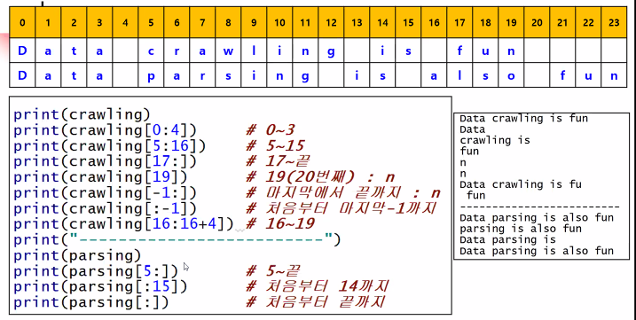
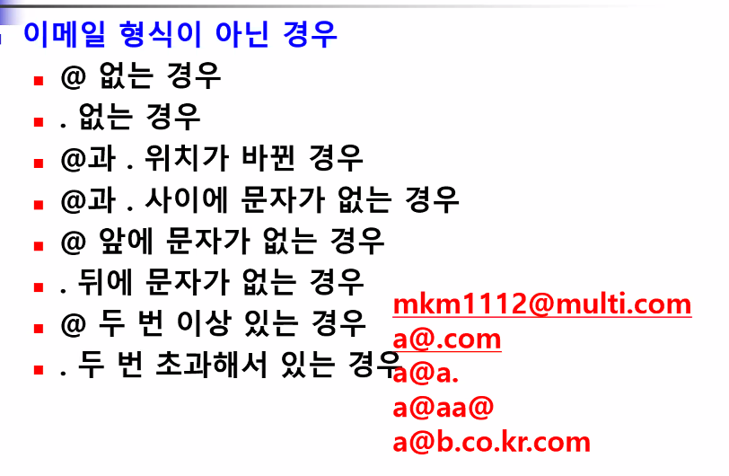

# 파이썬 기초(3)

> 문자열 기초, 문자열 관련 함수, 문자열 포맷팅, 날짜

## 0. 문자열

### 문자열+숫자

```python
num=123
print('a'+str(num))#str로 타입 변경후 더하기 연산 가능
```

### 문자열 곱하기

```python
string = 'a'
result = string * 3
print(result)
>>>
aaa
```

```python
#더하기
f='홍'
s='길동'
full=f+s
print(full)

#곱하기
full2=f * 3 #문자열의 곱하기 연산은 곱해지는 값이 반드시 정수
print(full2)

print(full+'이 랩을 한다 '+ full2)

#역삼각형 별그리기
for num in range(5,0,-1):
    print('*' * num)
>>>
홍길동
홍홍홍
홍길동이 랩을 한다 홍홍홍
*****
****
***
**
*
```


### 문자열 인덱싱

> 인덱스로 문자의 위치를 나타내는 것

* 문자열[0] : 문자의 0위치에 있는 값

* 인덱스는 0부터 시작

  ```
  #문자열 인덱싱
  string='일이삼사오'
  print(string[0])
  
  for i in string:
      if i == '일':
          print('일이 있다.')
      elif i != '멍':
          print('멍이 없다.')
          break
  >>>
  일
  일이 있다.
  멍이 없다
  ```


### 문자열 슬라이싱

> 문자열 중에서 일부분을 추출하는 것(잘라내는 것)

* 인덱스 사용




### in, notin

> 문자열 안에 특정 문자열의 포함 여부를 확인해서 T/F로 결과값을 돌려주는 연산자

```python
string ='Python Programming'
print('Python' in string)
print('programming'in string)

if 'ython' in string: #Python이 아니어도 있음 반환
    print('있음.')
else:
    print('없음.')
>>>
True
False
있음.
```

* 문자열에 적용하면 문자열의 부분집합과 비교

  

```python
ids=['sun','flower','moon','sky']
ID=input('ID 입력 :')
if ID in ids:
    print('로그인 성공 !')
else:
    print('로그인 실패 !')
>>>
ID 입력 :flo
로그인 실패 !
```

* 리스트에 적용하면 문자열의 부분 데이터와 비교


## 1.문자열 관련 함수

### `len()`

문자열의 길이 반환

파이썬 자체가 제공하는 일반 함수로 string.len()할 필요가 없음

```python
string = 'programming'
print(len(string))
>>>
11
```


### `count()`

문자열 내에 있는 특정 문자(열)의 개수 반환

문장을 분석해서 통계를 추출하거나 판단할 때 사용

```python
string = 'programming'
print(string.count('m'))
>>
2
```


### `find()`

문자열 내에서 특정 문자열이 존재하는지 여부와 문자열의 시작위치를 반환
존재하지 않으면 -1 반환
필요한 문자열만 추출할 수 있도록 필터링 하거나 검사할 때 주로 사용


### `index()`

문자열 내에서 특정 문자열의 시작 위치를 반환
`find()` 존재하지 않으면 -1을 반환, but `index()`는 존재하지 않으면 에러 발생

##### 예제)



```python
email=input('이메일 입력 :')
if (email.find('@')==-1 or #1 @가 없는 경우
    email.find('.')==-1 or #2 .이 없는 경우
    email.find('@.')!=-1 or  # 3,4
    #email.index('@') > #3,4 - email.index('.') @와 . 위치가 바뀐 경우
    email.find('.@')!=-1 or  # 3,4
    #email.index('.')-email.index('@') < 2) #@d와 . 사이에 문자가 없는 경우
    email.index('@')==0 or #5
    #email.index('.')==(len(email)-1) or #6 - 이 경우에는 aa@aa.aa. 같은 경우를 골라내지 못함
    email[-1] == '.' or #6
    email.count('@')>=2 or #7
    email.count('.')>2  or #8 - aa@aa..aa 경우를 골라낼 수 없음
    email.find('..')>-1):
        print('이메일 형식이 아닙니다.')
else:
    print('등록완료!')
print('입력한 이메일 : %s '%email)

>>>
이메일 입력 :sss@a.a.
이메일 형식이 아닙니다.
입력한 이메일 : sss@a.a. 
```


### `split()`

문자열을 구분자를 기준으로 나누어 리스트로 반환
구분자`('-', ',', ':')` 기본은 공백

```python
string='Python programming'
string_split=string.split()
print(string_split)# 리스트 형태로 반환
names='홍길동, 이몽룡, 성춘향, 변학도'
names_split=names.split(',')
print(names_split)

colors='red:blue:yellow'
colors_split=colors.split(':')
print(colors_split)

#for문 사용하여 split한 요소 추출
for i in colors_split:
    print(i, end=' ')

#문자열을 반복의 요소로 사용
#각 char별로 출력
for i in colors:
    print(i, end='/')    
>>>
4
0
```


### `replace()`

전체 문자열에서 특정 문자열을 찾아 다른 문자열로 변경
전체 문자열.replace(찾는 문자열, 변경할 문자열)
찾는 문자열이 존재하면 변경된 문자열 반환
찾는 문자열이 존재하지 않는 경우 변경된 내용이 없으므로 원래 문자열 반환

```python
course ='Java programing'
#Java>Python 변경
c_replace=course.replace('Java','Python')
print(c_replace)
print(course)
>>>
Python programing
Java programing
```


### `JOIN()`

```python
# 각 문자 사이에 특정 문자(열) 삽입

# a를 b사이에 삽입
a="aa"
print(a.join("bbb")) # baabaab

# 문자열 사이에 구분자 삽입
a = '-'
print(a.join("대한민국"))

n=', '
print(n.join(('12345')))

# 리스트에도 적용 가능
names=['홍길동','이몽룡','성춘향']
print('-'.join(names)) #str 형태의 문자열 1개가 반환

nums=['10','20','30']
nums2=[10,20,30]
print(','.join(nums))

>>>
baabaab
대-한-민-국
1, 2, 3, 4, 5
홍길동-이몽룡-성춘향
10,20,30
```

```python
nums2=[10,20,30]
print(','.join((nums2)))# 숫자 데이터에는 적용 불가
>>>
TypeError: sequence item 0: expected str instance, int found
```


### 대/소문자 변환 함수

> upper(), lower(), capitalize(), title()

upper(): 소문자 > 대문자
lower(): 대문자 > 소문자
capitalize() : 문장 첫 번째 문자 > 대문자
title() : 각 단어 첫 글자 > 대문자

```python
string='this is my DOG'
print(string.upper())
print(string.lower())
print(string.capitalize())
print(string.title())
>>>
THIS IS MY DOG
this is my dog
This is my dog
This Is My Dog
```


### 공백 제거 함수

> strip(), lstrip(), rstrip()

strip() : 문자열 앞 뒤의 공백 제거(양쪽)
lstrip() : left strip
rstrip() : right strip

#### 예제)

```python
ID = 'sun'
input_id=input('ID : ')
if input_id.strip()==ID: #공백 제거
    print('로그인 성공')
else :
    print('로그인 실패')
>>>
ID :          sun
로그인 성공
```


### `isalpha()` 관련 함수

```python
phone=input('전화번호(숫자만) : ')

if phone.isdigit() :
    pass #작업 없이 다음 블럭으로 진행
else :
    print('숫자만 입력!')
    
######################################
name=input('이름 입력 : ')
if phone.isalpha() :
    pass
else :
    print('문자만 입력하세요')
    
#####################################
ID =input('ID 입력 : ')
if not(ID.isalnum()):
    print('문자와 숫자만 사용할 수 있습니다')
    
#####################################
print(' '.isspace()) #True
print(' c'.isspace())#False
print('  '.isspace())#True
```

#### 예제)

```python
string=input('문장을 입력하세요 : ')
al=0
num=0
sp=0
etc=0
for i in string:
    if i.isalpha():
        al+=1
    elif i.isdigit():
        num+=1
    elif i.isspace():
        sp+=1
    else:
        etc+=1

print('알파벳 : %d개\n숫자 : %d개\n스페이스 : %d개\n기타 : %d개'%(al,num,sp,etc))
>>>
문장을 입력하세요 : 123   asdf!!
알파벳 : 4개
숫자 : 3개
스페이스 : 3개
기타 : 2개
```


## 2.문자열 포맷팅

```python
# 포맷팅 방법
# 포맷 코드를 사용
print('%s, %d, %.2f' %('홍길동',100,100.122222))

# 포맷 함수를 사용
print('당신의 bmi: ', format(50.555,'.2f'))

# 포맷 함수의 위치 인덱스 사용
# 문자열{위치인덱스}.format(변수)
name='홍길동'
age=23
print('이름 : {0}'.format(name))
print('이름 : {0}, 나이 : {1}'.format(name,age))

# 문자열{변수}.format(변수=값)
print('이름 : {name}, 나이 : {age}'.format(name='홍길동',age='22'))

# 실수 출력
pi=3.14
print("{0:.2f}".format(pi))
print("{0:10.2f}".format(pi)) # 전체 10 자리 지정
                             # 위치 인덱스 형식 함께 표현가능

# 실수 출력시 2개의 변수 표현
print("{0:10.2f},{1}".format(pi,100))

# 기호를 사용한 문자열 정렬
string='Python'
print("{0:<10}".format(string))# 전체 10개의 자릿수, 왼쪽 정렬
print("{0:>10}".format(string))# 전체 10개의 자릿수, 오른쪽 정렬
print("{0:^10}".format(string))# 전체 10개의 자릿수, 가운데 정렬

#공백 문자 지정
print("{0:-^10}".format(string)) # 전체 10 자릿수, 공백은 -로 채움, 가운데 정렬

#정렬 관련 함수 ljust(전체자릿수), center(), rjust()
print(string.ljust(10))
print(string.rjust(10))
print(string.center(10))
```


#### 금액 표시

```python
# 1000 단위마다 콤마 표시
# 1
def get_interest2(dps,rate):
    inter=dps*(rate/100)
    return int(inter)

# main
deposit=int(input('예금액 입력 : '))
int_rate=float(input('이자율 입력(%) : '))

interest=format(get_interest2(deposit,int_rate),',')
print('이자액 : %s원 ' % interest) # format함수 사용시 형식 문자열로 변환

# 2
import locale
locale.setlocale(locale.LC_ALL, '') 
n = -1234567890.123
s = locale.format('%.3f', n, 1)

```

## 3.날짜 시간 출력 포맷팅

```python
# 날짜와 시간을 사용하기 위해서는 datetime 모듈 import
# 모듈(Module)
from datetime import date, datetime, timedelta

#오늘 날짜를 반환하는 함수 date.today()
today = date.today() #today 라는 개체가 갖고 있는 변수 year
print(today)
year=today.year
month=today.month
day=today.day

print('오늘 날짜 : {0}'.format(today))
print('연도 : {0}'.format(year))
print('월 : {0}'.format(month))
print('일 : {0}'.format(day))

#현재시간
c_date=datetime.now() #현재 날짜와 시간 바환
print(c_date)

c_time = datetime.now().time() #현재 날짜와 시간에서 시간만 다시 추출
print(c_time)
hour=c_time.hour
minute=c_time.minute
second=c_time.second
m_second =c_time.microsecond

# 프로그래밍 언어에서 날짜와 시간 data는 최종적으로 숫자로 처리
print(type(c_date))
print(type(c_time))
print(type(m_second))
print('현재 시간 : {0}'.format(c_time))
print('시 : {0}'.format(hour))
print('분 : {0}'.format(minute))
print('초 : {0}'.format(second))
print('마이크로초 : {0}'.format(m_second))

# 날짜는 계산이 가능
# 날짜 계산시 사용하는 함수 : timedelta()
today=date.today() # 오늘 날짜
print('오늘 : {0}'.format(today))
print('어제 : {0}'.format(today + timedelta(days=-1)))
print('내일 : {0}'.format(today + timedelta(days=+1)))

print('일주일전 : {0}'.format(today + timedelta(days=+7)))
print('일주일후 : {0}'.format(today + timedelta(days=-7)))

print('--------시간 계산----------')
c_time=datetime.now()
print('현재 시간 : {0}'.format(c_time))
# 1시간 전
print('1시간 전 : {0}'.format(c_time + timedelta(hours=-1)))
# 1시간 후
print('1시간 전 : {0}'.format(c_time + timedelta(hours=+1)))
# 1일 2시간 후
print('1일 2시간 후 : {0}'.format(c_time + timedelta(days=+1,hours=2)))

print('------------날짜 출력 형식------------')
# strftime() : 날짜 형식을 문자열로 변환
today=date.today()
print(today)
today=datetime.today()
print(today)
now=datetime.now()# datetime.today()와 datetime.now()의 결과값 같음
print(now)

# 대문자 Y : 연도를 4자리로 표현, 소문자 y : 연도를 2자리로 표현
# %H : 시간을 24시간제, %I : 시간을 12시간제, p : AM, PM

print(today.strftime('%Y-%m-%d %H:%M:%S'))
print(today.strftime('%y-%m-%d %I:%M:%S %p'))

# strptime() : 문자열을 날짜 형식으로 변환
# 기존에 있는 문자열이 어떤 타입을 가지고 있는지 알려주기 위한 목적
str_date='2019-06-25 14:35:20'
print(type(str_date)) # <class 'str'>
date=datetime.strptime(str_date,'%Y-%m-%d %H:%M:%S')
print(type(date))
print('date : ', date)

>>>
2021-01-04
오늘 날짜 : 2021-01-04
연도 : 2021
월 : 1
일 : 4
2021-01-04 13:23:09.446047
13:23:09.446047
<class 'datetime.datetime'>
<class 'datetime.time'>
<class 'int'>
현재 시간 : 13:23:09.446047
시 : 13
분 : 23
초 : 9
마이크로초 : 446047
오늘 : 2021-01-04
어제 : 2021-01-03
내일 : 2021-01-05
일주일전 : 2021-01-11
일주일후 : 2020-12-28
--------시간 계산----------
현재 시간 : 2021-01-04 13:23:09.446047
1시간 전 : 2021-01-04 12:23:09.446047
1시간 전 : 2021-01-04 14:23:09.446047
1일 2시간 후 : 2021-01-05 15:23:09.446047
------------날짜 출력 형식------------
2021-01-04
2021-01-04 13:23:09.447050
2021-01-04 13:23:09.447050
2021-01-04 13:23:09
21-01-04 01:23:09 PM
<class 'str'>
<class 'datetime.datetime'>
```