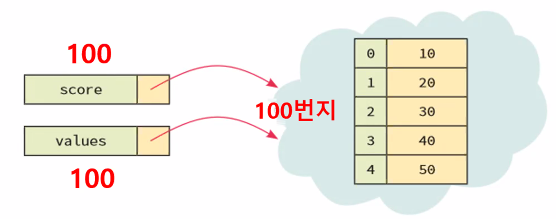
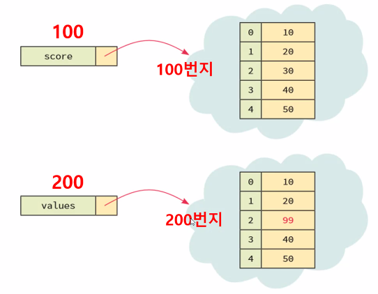
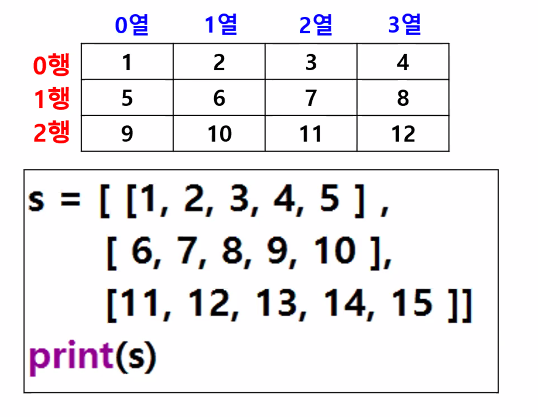

# 파이썬 기초(4)

> 리스트

## 0.리스트

> 동일한 이름을 갖는 원소들의 연속 저장 영역
> 집합적 자료형 : 여러개의 데이터 저장되어 있는 장소
> 크기 가변적
> 서로 다른 종류의 데이터를 하나의 리스트 안에 저장 가능


### 리스트 생성

```python
# 리스트 만들기
num=[]
num_int =[1,2,3,4,5]
num_names=[1,2.0,True,'이몽룡'] # 여러 타입의 데이터를 하나의 리스트에 저장 가능

# 리스트 안에 리스트 포함
numbers=[100,[200,[300,[400]]]]
print(numbers[1][1][1])

# for문 사용하여 출력
for num in numbers:
    print(num)

print('------------------------')
# range() 함수 사용하여 출력
for i in range(0, len(numbers)):
    print(numbers[i])

# 리스트의 각 원소를 변수에 저장
nums=[1,2,3]
a=nums[0]
b=nums[1]
c=nums[2]
print(a,b,c)
d,e,f=nums
print(d,e,f)
g,h=nums # Value 에러발생
>>>
[400]
100
[200, [300, [400]]]
------------------------
100
[200, [300, [400]]]
1 2 3
1 2 3
ValueError: too many values to unpack (expected 2)
```


### 리스트 in 리스트

```python
a =[1,2,3,[10,20]]
print(a[-1][0]) 
c=[1,2,3,[10,20],4,5]
print(c[3][1])

all_list=[a,c]
print(all_list[0][3][0])
print(all_list[-1][3][0])
>>>
10
20
10
10
```


### 리스트 슬라이싱(slicing)

> 리스트 안에서 범위를 지정하여 원하는 요소들을 선택하는 연산
>
> 문자열 슬라이싱과 유사

* 리스트[start,end] : start에서 end-1 요소까지 선택(인덱스는 0부터 시작하므로)
* `+ `  : 리스트 합치기
* `*` : 반복
* `=` : 리스트 내용 변경(특정 위치의 요소에 값 저장)

``` python
# 리스트_기본.py
# 리스트 만들기
num=[]
num_int =[1,2,3,4,5]
num_names=[1,2.0,True,'이몽룡'] # 여러 타입의 데이터를 하나의 리스트에 저장 가능

# 리스트 안에 리스트 포함
numbers=[100,[200,[300,[400]]]]
print(numbers[1][1][1])

# for문 사용하여 출력
for num in numbers:
    print(num)

print('------------------------')
# range() 함수 사용하여 출력
for i in range(0, len(numbers)):
    print(numbers[i])

# 리스트의 각 원소를 변수에 저장
nums=[1,2,3]
a=nums[0]
b=nums[1]
c=nums[2]
print(a,b,c)
d,e,f=nums
print(d,e,f)
# g,h=nums # Value 에러발생
# print(g,h)

a =[1,2,3,[10,20]]
print(a[-1][0]) # 마지막 요소의 첫번째 요소
c=[1,2,3,[10,20],4,5]
print(c[3][1])

all_list=[a,c]
print(all_list[0][3][0])
print(all_list[-1][3][0])

# 리스트 연산
a=[1,2,3]
b=[4,5,6]

# 병합
c=a+b
print(c)

# 반복
print(a*3)

# 내용변경
a[2]=30
print(a)

# 내용변경(슬라이싱으로 접근)
a[0:2]=[10,20]
print(a)

# 인덱싱을 통해 리스트 대입시 하위리스트로 생성
b[0]=[1,2,3,4]
print(b)

# 빈 리스트를 저장하면 참조하는 데이터의 값이 삭제
print(c[0:3])
print('전 : ', c)
c[1:3] =[]
print('후 : ', c)
>>>
[1, 2, 3, 4, 5, 6]
[1, 2, 3, 1, 2, 3, 1, 2, 3]
[1, 2, 30]
[10, 20, 30]
[[1, 2, 3, 4], 5, 6]
[1, 2, 3]
전 :  [1, 2, 3, 4, 5, 6]
후 :  [1, 4, 5, 6]
```


### 리스트 복사

#### 리스트 변수의 특징

> 리스트 객체를 직접 저장하고 있는 것이 아니라 리스트 자체는 다른 곳에 저장되어 있고, 참조값(reference)만 변수에 저장


#### 리스트 복사 방식

* ##### 얕은 복사

  > 실제 리스트가 아닌 참조값(리스트가 저장된 주소)만 복사
  >
  > 복사본 리스트 요소의 값을 변경하면 원본 리스트 요소의 값도 변경

  

  ```python
  scores = [10,20,30,40]
  values = scores # 원본 보관
  values[0]=100 # 복사본 리스트의 요소값 변경
  print(values)
  print(scores) 
  >>>
  [100, 20, 30, 40]
  [100, 20, 30, 40] # 원본값 변경
  ```

  

  

* ##### 깊은 복사

  > 리시트의 복사본을 새로 생성하여 반환(원본 리스트의 데이터를 다른 곳에 한 번 더 저장하고 그 주소를 반환)
  >
  > 복사본 리스트의 값을 변경해도 원본 리스트 값은 변경되지 않음
  >
  > 대입연산자( `=`)  로는 불가능 > list() 또는 deepcopy() 함수 사용
  >
  > deepcopy()는 파이썬 내장 함수가 아니므로 모듈 copy import 필요

  

  ```python
  import copy
  a=['a','b','c']
  b=copy.deepcopy(a)
  
  b[0]=1
  print(a)
  print(b)
  >>>
  ['a', 'b', 'c']
  [1, 'b', 'c'] # 복사한 값만 변경
  ```

  

## 1. 내장함수 vs 메소드

### 내장함수

> 함수 : 특정 기능을 수행하는 코드 집합
>
> 내장 함수 : 파이썬에 이미 만들어져 있는 함수들

```python
print(변수(객체))
len(리스트)
```

```python
a=[1,2,3,4,5]
# len() : 리스트 전체의 개수 반환
print(len(a))
>>>
5

# count() : 리스트 내에서 특정 요소(값)의 개수 세기
print(a.count(3))
>>>
1
```

### 메소드

> 함수와 같은 코드 집합이지만 클래스의 멤버로 객체를 통해서만 사용 가능

```python
객체.메소드()
```

#### `append()` 

> 리스트 끝에 새로운 요소 추가

```python
리스트.append(값)
```

```python
a=[1,2,3,4,5]
a.append(5)
print(a)
>>>
[1, 2, 3, 4, 5, 5]

# 리스트 끝에 하위 리스트로 추가
a.append([6,7]) 
# a.append(8,9) # TypeError: append() takes exactly one argument (2 given) 1개의 요소만 append 가능
>>>

```

```python
values=[]
values.append(10)
values.append(20)
values.append(30)
print(values)
>>>
[10,20,30]

# for 문을 사용해서 요소 추가
scores=[]
for i in range(5):
    scores.append(i)
print(scores) #[0,1,2,3,4]
```


#### `insert()`

> 특정 위치에 요소 삽입

```python
리스트.insert(위치, 값)
```

```python
a=[1,2,3,4,5]
a.insert(2,300)
print(a)
>>>
[1, 2, 300, 3, 4, 5]

# 마지막 원소 앞에 삽입
a.insert(-1,'홍길동') 
print(a)
>>>
[1, 2, 300, 3, 4, '홍길동', 5]

a.insert(7,12.3)
print(a)
>>>
[1, 2, 300, 3, 4, '홍길동', 5, 12.3]

a.insert(len(a),12.3) # 맨 뒤에 삽입
print(a)
>>>
[1, 2, 300, 3, 4, '홍길동', 5, 12.3, 12.3]

a.insert(10,'마지막') # 기존 인덱스 +1 까지의 위치가 아니면 무조건 마지막에 삽입
print(a)
>>>
[1, 2, 300, 3, 4, '홍길동', 5, 12.3, 12.3, '마지막']
```

##### 예제1)

```python
lst=[]
for i in range(3):
    name=input('회원 입력 : ')
    lst.append(name)

print('회원명단 : ', end=' ')
for name in lst:
    print(name, end=' ')
>>>
회원 입력 : a
회원 입력 : b
회원 입력 : c
회원명단 :  a b c 
```

##### 예제2)

```python
stud=[]
sum=0 # 점수 총합을 구할 누적변수
count=0 # 80점 이상 count할 누적 변수

for i in range(1,6):
    score=int(input('학생%d 점수 입력 : '%i))
    stud.append(score)

print(stud)
for s in stud:
    sum+=s
    if s >=80:
        count+=1
    else:
        pass

print('총점 : %d' % sum)
print('평균 : %.2f' % (sum/len(stud)))
print('80점 이상 학생 : %d명' % count)
>>>
학생1 점수 입력 : 70
학생2 점수 입력 : 80
학생3 점수 입력 : 9
학생4 점수 입력 : 90
학생5 점수 입력 : 10
[70, 80, 9, 90, 10]
총점 : 259
평균 : 51.80
80점 이상 학생 : 2명
```

#### `remove() `

>  리스트에서 값에 해당되는 요소 제거, 동일값이 여러개일 경우 첫번째 값만 제거

```python
리스트.remobve(값)
```


#### `pop()`

>  리스트의 마지막 요소 or 인덱스 위치에 있는 요소 반환하고 삭제

```python
리스트.pop()
리스트.pop(인덱스)
```

```
nums=[1,2,3,3,3,4,5,6,7]
# 동일한 원소를 한꺼번에 제거
# 제거하고자 하는 원소가 몇 개 있는지 확인
count = nums.count(3)

for i in range(count):
    nums.remove(3)
    print('3 삭제 : ', nums)

print(nums)

# 반복문 주의 : 제거하려는 원소가 모두 제거된 후에 제거 명령이 들어가면 에러
# remove() 제거 요소가 없으면 에러 발생

# pop() : 리스트의 마지막 요소 반환하고 삭제
# 리스트가 비었는데 pop() 하면 에러 발생
x=['a','b','c','d']
y=[]
y.append(x.pop())
y.append(x.pop())
y.append(x.pop())
print(x)
print(y)


# pop(인덱스): 인덱스 위치에 있는 요소 반환하고 삭제
heros =['수퍼맨','스파이더맨','헐크','아이언맨']
h=heros.pop(2)
print(heros)
print(h)
```

#### `extend()`

> 이전 리스트에 원소 추가하여 확장된 리스트로 됨, 원래 리스트 변경됨

```python
리스트.extend()
```

```python
a = [1,2,3]
a.extend([4,5])
print()
print('extend : ', a)

# append와 insert는 하위 리스트로 추가됨
a=[1,2,3]
a.append([4,5])
print('append : ', a)
>>>
extend :  [1, 2, 3, 4, 5]
append :  [1, 2, 3, [4, 5]]
```

#### `sort()` 

>  원본 리스트 정렬

```python
scores=[5,1,3,2,4]
scores.sort()
print(scores)

#reverse 옵션 적용
scores.sort(reverse=True)
print(scores)
>>>
[1, 2, 3, 4, 5]
[5, 4, 3, 2, 1]
```

* ##### 영문자 : 대문자 앞, 소문자 뒤로 정렬

  ``` python
  char=['b','A','D','c']
  char.sort()
  print(char)
  >>>
  ['A', 'D', 'b', 'c']
  ```

* ##### 영문 대소문자 구별 없이 정렬 : key=str.lower

  ```python
  char=['b','A','D','c']
  char.sort(key=str.lower)
  print(char)
  >>>
  ['A', 'b', 'c', 'D']
  ```

* ##### 대소문자 구별 없이 내림차순 정렬

  ```python
  char=['b','A','D','c']
  char.sort(key=str.lower,reverse=True)
  print(char)
  >>>
  ['A', 'b', 'c', 'D']
  ```

* ##### 문자열 정렬: 첫문자를 기준으로, 대소문자 구분없이 정렬

  ```python
  ids=['SKY','Blue','Green','eBook','red']
  ids.sort(key=str.lower)
  >>>
  ['Blue', 'Green', 'SKY', 'eBook', 'red']
  ```

#### `sorted()` 

> 원본 유지하면서 정렬된 새로운 리스트 반환(내장함수)

```python
a=[3,5,2,1,4]
b=sorted(a)
print('a : ', a)
print('b : ', b)
```


#### `reverse()` 

> 역순으로 원본 리스트 순서 변경 (정렬X)


#### `max()`, `min()` 

> 리스트 내에서 최대 최소값을 반환

```python
n=[100,7,-2,99,30]
print('최대 : ', max(n))
print('최소 : ', min(n))

# 문자는 아스키 코드 값으로 비교
n=['c','a','D','A','b']
print('최대 : ', max(n))
print('최소 : ', min(n))
>>>
최대 :  100
최소 :  -2
최대 :  c
최소 :  A
```


#### `index()` 

> 리스트 안에서 특정 원소의 위치값 반환, 원소가 존재하지 않으면 에러

```python
n=[100,7,-2,99,30]
n.index(100)
```

  

## 2. 리스트 일치 검사

 * 첫 번째 요소부터 비교 시작

 * 첫 번째 요소의 비교에서 결과가 False 이면 더이상 비교하지 않고 종료

 * 첫 번째 요소가 동일하면 두 번째 요소 비교

 * 리스트 안의 모든 요소 비교 결과가 True면  전체 결과가 True

```python
names=['홍길동','성춘향']
print(names.index('성춘향'))
```


## 3. 2차원 리스트

