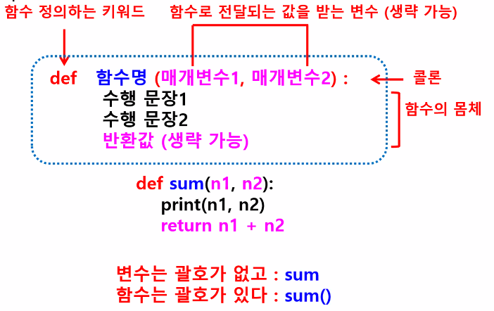
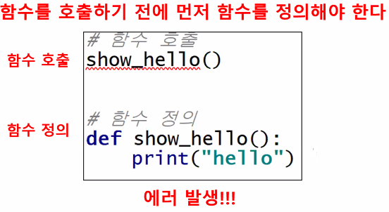
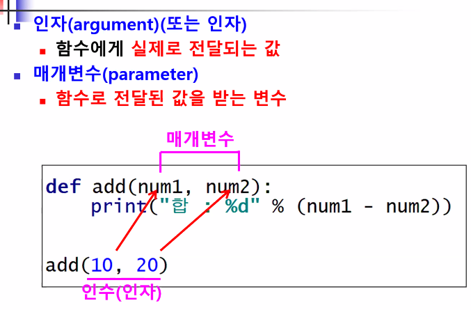

# 파이썬 기초(6)

>  함수

## 1. 함수

### 함수의 개념

* ##### 특정 작업을 수행하는 코드 집합

* ##### 사용목적

  * 코드 재사용
  * 중복된 코드 제거 
  * 작업 분해 : 복잡하고 긴 내용을 기능별로 분리해서 함수로 만들어 사용

* ##### 함수사용 장점

  * 경제적(코드 재사용)
  * 프로그램 가독성 증대(작업 분해)
  * 프로그램 유지 관리 용이 : 변경사항 발생시 함수만 수정 작업

* ##### 함수의 종류

  * 내장함수 : 파이썬에 만들어져 있는 함수들
    * 형식에 맞춰 함수이름만 호출해서 사용
    * 특정 객체를 통해 사용 가능한 함수(메소드)
  * 사용자 정의 함수 : 사용자가 임의로 만들어서 사용하는 함수
  * Third party 함수, 패키지 : 다른 사용자들이 만들어 배포해놓은 함수, 패키지

* ##### 함수의 구조

  

* ##### 함수의 이름

  * 함수의 목적을 설명하는 동사 or 동사+명사 
  
* PyCharm에서는 함수 이름은 소문자 사용 권장
  
  
  

### 함수 사용



  ​	`NameError : name 'show_hello' is not defined`

#### 함수 정의

```python
함수 정의 :
def 함수명('매개변수1,매개변수2,매개변수3...') #사용자가 함수 실행에 필요한 값을 전달하면 저장하는 변수
     함수 실행부분...:
       [반환문(return)] # 생략 가능
```

```python
def show_info():
    print('성명 : 홍길동')
    print('나이 : 20')
    
# 함수 정의만 되어있는 상태에서의 실행은 아무작업도 일어나지 않는다
# 정의된 함수는 호출해야 실행된다
# 호출 : 함수명(값1, 값2)
show_info() # 함수 호출

# 매개 변수가 있는 함수
def show_info_input(name,age):
    print('성명 : ',name)
    print('나이 : ',age)

show_info_input('멍멍이',33)
>>>
성명 : 홍길동
나이 : 20
성명 :  멍멍이
나이 :  33
```

```python
from datetime import date,datetime,timedelta

def return_today(): # 오늘 날짜를 반환하는 함수
    return date.today()

show=show_info()
print(show) # 반환값이 없는경우 변수에 넣어 출력 시 None 출력

dt=return_today()
print(dt) # 반환값이 있는경우
>>>
None
2021-01-05
```

#### 예제1) 사각형 면적 계산 함수

```python
def get_area():
    garo=int(input('가로길이 입력 : '))
    sero=int(input('세로길이 입력 : '))
    return garo*sero

result=get_area()
print('사각형의 면적 : %d'%result)
```

#### 예제2) 상품가격,주문수량 출력 함수

```python
def order():
    price=int(input('상품가격 입력 : '))
    cnt=int(input('주문수량 입력 : '))
    o_price=cnt*price
    return price,cnt,o_price

a,b,c=order()
print('------------------------\n')
print('상품가격 : %d\n주문수량 : %d\n주문액 : %d'%(a,b,c))
```


### 리턴(return)

#### 서로다른 자료형의 리턴

```python
def get_names():
    names=[]
    for i in range(3):
        name=input('이름입력 :')
        names.append(name)
    return names # 리스트 반환

def get_names_dict():
    names={}
    for i in range(3):
        name=input('이름입력 : ')
        age=input('나이입력 : ')
        names[name]=age
    return names

print(get_names())
print(get_names_dict())
>>>
이름입력 :김
이름입력 :박
이름입력 :이
['김', '박', '이']
이름입력 : 김
나이입력 : 22
이름입력 : 박
나이입력 : 44
이름입력 : 이
나이입력 : 13
{'김': '22', '박': '44', '이': '13'}
```


### 인자/매개변수



### 인자

```python
def calc(n1,n2):
    return n1+n2

calc(2,3) # 인수 반드시 2개 전달
# calc(2) TypeError: calc() missing 1 required positional argument: 'n2'
```

#### 예제1) 사칙연산

```python
# 값 두개를 전달받아 사칙연산하는 함수 정의
def add(num1,num2):
    return num1+num2

def sub(num1,num2):
    return num1-num2

def mul(num1,num2):
    return num1*num2

def div(num1,num2):
    return num1/num2

print(add(3,9))
print(sub(3,9))
print(mul(3,9))
print(div(3,9))
```

#### 예제2) 사칙연산 2

```python
# 사칙연산 입력 기능 추가

def calc3(op,num1,num2):
    if op == '+':
        result = num1 + num2
    elif op == '-':
        result = num1 - num2
    elif op == '*':
        result = num1 * num2
    elif op == '/':
        result = num1 / num2
    return result

op_lst = ['+', '-', '*', '/']
while True:
    opr =input('연산자를 입력하세요 : ')
    if opr in op_lst:
        num1=int(input('수1 : '))
        num2=int(input('수2 : '))
        if(opr=='/') & (num2==0):
            print('다시 입력하세요.')
        else :
            print(calc3(opr,num1,num2))
            break
    else:
        print('잘못된 연산자입니다. 다시입력하세요')
```


### 매개변수

#### 디폴트값 설정

```
# 매개변수에 기본값 지정할 수 있다
print('abc',end='0')

# 디폴트 매개변수는 반드시 위치가 마지막에 위치해야 함
# 디폴트 매개변수는 여러개 사용할 수 있음
# 앞에 올 경우 SyntaxError: non-default argument follows default argument
# def greet(msg='안녕!!', name):
#     print(name+','+msg)

def greet(name='은영', msg='안녕!!'):
    print(name+','+msg)

greet('kim','hello')
greet('lee')
greet()

def show_info(name,year=4,age=23):
    print(name,year,age)

show_info('홍길동')
show_info('홍길동',3)
show_info('홍길동',3,26)
# show_info('홍길동',,20) SyntaxError: invalid syntax
```


#### 매개변수로  list, dict, tuple 전달하기

```python
# 함수에 리스트 전달
def show_names(names):
    for name in names:
        print(name, end=' ')
name_list=['kim','lee','park']
show_names(name_list)

# 함수에 딕셔너리 전달
def show_info(info) :
    print(info)
    print('이름 : ',info['name'])

info_list={'name':'kim','age':23}
show_info(info_list)
show_info('aaa')
```


#### 가변길이 매개변수

> 1개의 매개변수로 개수가 정해지지 않은 여러 개의 값을 전달 받을 때 사용하는 매개변수

* ##### `*args` 

  > arguments의 약자, 인수 값을 받음, `args` 외의 다른 이름도 사용 가능

  ```python
  def sum(*args):
      ...
  ```

  

  ##### 예제)

  * 필수매개변수, 디폴트매개변수, 가변길이 매개변수 혼용 가능

  * 필수매개변수(일반)는 무조건 앞쪽에 배치 되어야 함

  ```python
  # 1개의 매개변수로 개수가 정해지지 않은 여러 개의 값을 전달 받을 때 사용하는 매개변수
  
  def test_args(*args) :
      print(type(args)) #*args 는 튜플형태로 구성됨
  
  test_args(1,2,3,4,5)
  
  # Kwargs 형태 확인
  def test_kwargs(**kwargs):
      print(type(kwargs))
  
  test_kwargs(a=1,b=2,c=3)
  
  # *args 예제 #############################################################
  def order_coffee(coffee, *options):  # 필수 매개변수와 가변길이 매개변수 혼용
      print(coffee + ', 옵션 : ', end=' ')
  
      for opt in options:
          print(opt,end=' ')
      print()
  
  order_coffee('아메리카노')
  order_coffee('아메리카노','Tall','Hot','시럽')
  #order_coffee() # TypeError: order_coffee() missing 1 required positional argument: 'coffee'
                 # 적어도 1개의 매개변수는 넘어와야 함
  
  
  ########################################################################
  def order_coffee(coffee, *options, fin='end'):  # 가변길이 매개변수 혼용
      print(coffee + ', 옵션 : ', end=' ')
  
      for opt in options:
          print(opt,end=' ')
      print(fin)
  
  order_coffee('아메리카노')
  order_coffee('아메리카노','Tall','Hot','시럽','abc')
  
  ########################################################################
  def order_coffee(coffee, fin='end', *options):  # 기본 변수(fin) 앞으로 빼면
      print(coffee + ', 옵션 : ', end=' ')
  
      for opt in options:
          print(opt,end=' ')
      print(fin)
  
  order_coffee('아메리카노')
  order_coffee('아메리카노','Tall','Hot','시럽','abc')
  
  ```

  

* ##### `**kwargs`

  > keyword arguments의 약자, key=value 값을 받음 ex) `end=' '`

  `kwargs` 외의 다른 이름도 사용 가능

  ```python
  def info(**kwargs):
      ...
  info(id='abcd',name='kim')
  ```

  

  ##### 예제)

  ```python
  # key=value의 값을 받음(dict 형태로 전달)
  def show_keywords(**kwargs):
      print('---------------------')
      for key in kwargs.keys():
          print(key, end=' ')
      print('\n')
  
      for val in kwargs.values():
          print(val,end=' ')
      print('\n')
  
      for item in kwargs.items():
          print(item)
  
  show_keywords(id='sun',
                name='kim',
                phone='010-1234-1234')
  
  
  show_keywords(n1=2,
                n2=2,
                n3=3,
                n4=4)
  
  # show_keywords(1=2) SyntaxError: keyword can't be an expression
  #                    **kwargs에서는 key는 반드시 문자형태. 숫자형태 쓸 수 없다
  ```


### 인수

#### 위치인수 

* 나열한 순서대로 매개변수에 전달되는 인수(위치값으로 전달될 변수를 정함)
* add(1,2,3) -> 1은 첫번째 매개변수로 3은 마지막 매개변수로 전달
* 함수 호출시 위치에 의하여 구별

* 키워드 인수와 혼용시 위치인수를 키워드 인수보다 앞에 두어야 함

  

#### 키워드 인수 

* 인수들 앞에 키워드를 두어서 인수를 구별

* 순서 변경 가능 : 인수의 순서가 매개변수의 순서와 달라도 됨


##### 예제) 위치 인수, 키워드 인수, 인수 혼용

```python
# add(1,2,3) -> 1은 첫번째 매개변수로 3은 마지막 매개변수로 전달
# add(a=1,c=3,b=2) -> 각 인수 앞에 키워드에 해당하는 변수로 전달(매개변수(인수) 순서를 변경할 수 있음)

# 매개변수를 딕셔너리로 변환해주는 함수
def student_info(name,age,gender) :
    student ={
        'name':name,
        'age':age,
        'gender':gender
    }
    return student

# 위치인수
student_info('kim',23,'여')

# 키워드인수
student_info(age=23,name='kim',gender='여')

# 혼용사용
print(student_info('lee',gender='남',age=25))
print(student_info('lee',22,gender='남'))

# 혼용사용 에러 - 위치인수와 키워드 인수를 혼용하려면 무조건 위치인수가 앞에 있어야 함
# print(student_info(name='lee',gender='남',25))
# >>> SyntaxError: positional argument follows keyword argument
```


### 지역변수/전역변수

#### 지역변수(local variable)

* 함수의 매개변수도 지역 변수
* 함수 내부에서 정의된 변수
* 외부로부터 값을 전달 받아서 함수 내부에서만 사용
* 함수 호출시 생성하고 함수가 종료되면 소멸(사용불가)

```python
def show():
    a=1 # 지역 변수 - 이 지점에서 변수 생성
    print(a) # 코드 실행 후 변수가 사라짐


show()
# print(a) # NameError: name 'a' is not defined
         # 함수 외부이기 때문에 사용 불가
```


#### 전역변수(global_variable)

* 함수 외부에서 정의된 변수
* 프로그램 내 모든 곳에서 사용 가능
* 함수 내에서 전역변수 값을 변경하려면 global 키워드 사용
* 가급적이면 사용하지 않음(개발자간 상호 사용 전제하에만 사용)

```python
a=1 # 전역변수 : 함수 밖에서 선언
b=1 #
def show():
    c=a+b       # c = 지역변수
    print('함수 내부에서 출력')
    print(a)    # 전역변수
    print(b)    # 전역변수
    print(c)    # 지역변수

def add():
    global a    # 전역변수 a를 사용 : global 처리
    a+=1        # global a 선언하지 않으면 참조 오류, 전역변수 a값 변경(1 -> 2)
    c=a+b       # b는 전역변수
    print('함수 내부에서 출력')
    print(a)
    print(b)
    print(c)    # 지역변수

b+=10 # 1 -> 11
show()
add()
print(a) # 2
print(b)
>>>
1
11
12
함수 내부에서 출력
2
11
13
2
11
```


##### 예제) 지역변수, 전역변수 결과 출력 예상

```python
def sub(x,y):
    global a
    a=7         # 전역변수 a값 함수 내부에서 변경
    x,y=y,x     # x, y값 함수 내부에서 스위치
    b=3         # 지역변수
    print(a,b,x,y)

a,b,x,y=1,2,3,4
sub(x,y)        # 7 3 4 3 / b,x,y는 2,3,4로 초기화
print(a,b,x,y)  # 7 2 3 4
>>>
7 3 4 3
7 2 3 4
```


#### 리스트를 함수에 전달할 때

* 리스트를 매개변수로 전달하면 함수 내, 함수 외에서 동일한 리스트를 사용하게 됨

* 전달된 리스트 요소의 일부를 함수내에서 변경하면 원본 리스트도 동일하게 변경됨

* 단, 함수 내에서 변수=[값1,값2,값3] 형식의 리스트 변수를 생성하면 해당변수는 완전한 지역변수로 처리 됨

```python
# 매개변수의 값으로 리스트를 전달했을 경우
# 함수에서 리스 요소 변경시 원본 리스트도 변경

def show_list(my_list):     # 매개변수 my_list-지역변수
    print('전달된 리스트 변경 없음 : ',my_list)
    my_list[0]=10
    print('1.id(함수내-매개변수): ', id(my_list))
    my_list=[100,200,300]
    print('함수 내에서 my_list 전체 값을 다시 저장')
    print(my_list)
    print('3. id(함수내-매개변수) : ',id(my_list))

my_list = [1,2,3,4]     # 전역변수
print('함수 호출 전')
print(my_list)
print('함수 호출')
show_list(my_list)
print('함수 호출 후')
print(my_list)
print('2. id(함수외-전역변수): ',id(my_list))
# id 값이 같다 : 서로 같은 메모리 공간을 가지고 있으므로 동일한 변수임
>>>
함수 호출 전
[1, 2, 3, 4]
함수 호출
전달된 리스트 변경 없음 :  [1, 2, 3, 4]
1.id(함수내-매개변수):  2046772793864
함수 내에서 my_list 전체 값을 다시 저장
[100, 200, 300]
3. id(함수내-매개변수) :  2046774293576
함수 호출 후
[10, 2, 3, 4]
2. id(함수외-전역변수):  2046772793864
```


#### 딕셔너리를 함수에 전달할 때

```python
product_list=[{'name':'노트북', 'price':1200000},
              {'name':'냉장고', 'price':1700000}]

# 딕셔너리를 전달받아 일부분만 추출해서 딕셔너리 형태로 반환하는 함수
def get_product_inf(prd_dic):
    name=prd_dic['name']
    price=prd_dic['price']
    a={'no1':name, 'no2':price}
    # return a # 이렇게 해도 되고, 아래처럼 변수 대입 없이 바로 딕셔너리 return 해도 상관 없음
    return {'no1':name, 'no2':price}

# 리스트에서 딕셔너리를 함수에 전달
# 반환값 받아서 출력

for prd in product_list:
    prd_info = get_product_inf(prd)
    print(prd_info)
```


##### 예제) 인자 전달받아 딕셔너리로 반환

```python
def show_info(name,grade,age,phone):
    return {'name':name,'grade':grade,'age':age,'phone':phone}

print(show_info('홍길동','4','10','1234'))
```