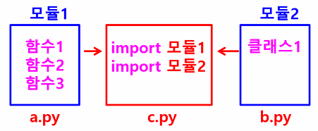
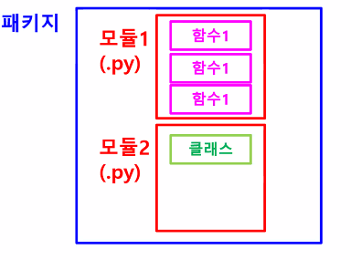
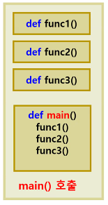

# 파이썬 기초(7)

> 내장함수, 모듈, 메인함수

## 0.내장함수(Built-in-fuctions)

> 파이썬에 이미 만들어져 내장되어 있는 함수들

* 별도의 모듈을 import 하지 않고 사용 가능
* 형식에 마줘 함수 이름만 호출해서 사용
* 특정 객체를 통해 사용 가능한 함수(메소드)
  * 문자열.sort(), 문자열.split() ...

[내장함수 list 볼 수 있는 사이트](https://docs.python.org/ko/3.7/library/functions.html)


### 자주 사용하는 내장함수

```python
# abs() : 절댓값 반환
print(abs(-10))

# iterable : 리스트, 튜플, 딕셔너리, 집합
# all(iterable) : 모든 요소가 참이면 True, 아니면 False 반환
print(all([1,2,3]))
print(all([0,2,3])) # False
print(all([1,2,3,'a']))

# any(iterable) : 하나라도 참이면 True, 모두 거짓이면 False
print(any([1,2,3])) # True
print(any([0,0,0])) # False
print(any([0,'',[]])) # 빈 문자열, 빈 리스트 = False
print(any([None])) # None=False

# chr(i) : i 아스키코드를 전달 - 해당 아스키코드 값의 문자 반환
print(chr(97)) # a
print(chr(65)) # A
print(chr(13)) # 키보드에서 enter키에 해당
print(chr(100)) # d

# ord(c) : c=문자, chr과 반대로 문자에 해당하는 아스키코드 값 반환
print(ord('a')) # 65
print(ord('A')) # 98
print(ord('0')) #48
print(ord(' ')) # 32
print(ord('\n')) # 10
print(ord('\r')) # enter

# divmod(a,b) : a를 b로 나눈 몫과 나머지를 튜플 형태로 반환
print(divmod(7,3))

# enumerate(iterable,start=0)
# 시퀀스(리스트, 튜플, 문자열, range)를 인덱스값을 포함하는 enumerate 객체로 반환
print(enumerate(['kim','lee','park']))

# enumerate 객체의 각 요소 출력
for i,value in enumerate(['kim','lee','park']) :
    print(i,value)
# for 문 처럼 반복되는 구간에서 객체가 현재 어느 위치에 있는지 알려주는 인덱스 값이 필요할 때

# filter(function, iterable) : 반복 가능한 자료형의 요소들이 function에 전달되었을 때 반환(결과)값이 True인 것만 걸러내서 반환
def positive(x):
    return x>0 # 반환값이 양수인 경우에 True

print(filter(positive,[0,1,-2,5,-7,10])) #<filter object at 0x0000012D7B393C88>
print(list(filter(positive,[0,1,-2,5,-7,10])))

# help([object]) # 내장 도움말 시스템 호출
help(print)

# map(function, iterable)
def increase(x) :
    return x+1
print(map(increase,[1,2,3,4,5])) # 맵 객체로 넘어옴 <map object at 0x00000180E238E108>
print(list(map(increase,[1,2,3,4,5]))) # 지정한 함수에 지정한 값을 넣어 결과값을 리스트로 반환
print(list(filter(positive,[1,2,3,4,5]))) # True인 경우 그대로 반환

# open(filename, [mode]) : mode로 파일 열기
# mode(읽기 방법) 생략시 읽기 전용 모드(r) 기본
# w(쓰기) r(읽기) a(추가) b(바이너리)-이미지
file_write = open('my_file.txt','w')

# sum(iterable) : iterable 모든 요소의 합 반환
print(sum([1,2,3,4,5]))

# zip(*iterable) : 각 iterable에서 동일한 인덱스의 요소를 추출하여 묶어서(튜플) 반환
print(list(zip([1,2,3,4],[5,6,7,8],[9,10,11,12])))
print(list(zip([1,2,3,4],[5,6,7]))) # 짝을 지을 수 없는 경우 제외후 반환

# zip() 함수를 사용해서 튜플로부터 딕셔너리 생성
keys=('a','b','c')
values=(1,2,3)
result=dict(zip(keys,values))
print(result)

print(int('11',2)) # 문자열 11을 이진수 11로 변경 -> 10진수 3
print(int('11',2)) # 문자열 11을 이진수 11로 변경 -> 10진수 3
print(int('A',16)) # A(16진수) -> 10진수 10

```


## 1. 모듈(Module)

> 함수, 변수, 클래스 들을 모아놓은 파일


### 모듈 사용



* 하나의 파일에 모든 코드를 넣지 않고, 함수, 변수, 클래스 단위로 별도의 파일을 만들어 놓고
* 필요한 데서 import 해서 사용


### 함수 / 모듈 / 패키지



* 함수 : 특정 기능을 수행하는 코드 집합
* 모듈 : 함수들을 모아 놓은 파일
* 패키지 : 여러 모듈들을 모아 놓은 디렉터리


### 모듈을 사용하는 이유

* 코드의 재사용(경제적)

* 효율적 : 코드를 기능에 따라 모듈 단위로 분리하여 설계함으로써 효율적인 개발 유지보수 가능

* 독립적인 네임스페이스(이름 공간) : 모듈마다 서로 다른 영역이므로 동일한 이름의 함수나 변수들을 각 모듈에서 사용 가능

  

### 모듈의 종류

표준 모듈(파이썬 패키지 안 기본 모듈), 사용자 정의 모듈, 써드 파티 모듈(다른 업체나 개인이 만들어 제공하는 모듈)


### 모듈 선언 방법

#### 모듈 전체 참조

```python
import 모듈명(파일명) : import math
import 모듈명 as 별칭 : import pandas as pd
    
```

#### 모듈 내 함수 참조

```python
모듈명.함수명 : math.pow()
```

#### 모듈 내 일부 참조

```python
from 모듈명 import 변수명, 함수명
#ex. from wordcloud import ImageColorgenerator
from 모둘명 import * #모듈 내에서 _로 시작하는 스페셜 변수나 매직 매서드를 제외한 모든것 참조
```


### 모듈 사용

* 사용할 모듈과 같은 폴더에 저장되어 있는 파일

```python
# new_calc.py
def add(num1,num2):
    return num1+num2

def sub(num1,num2):
    return num1-num2

def mul(num1,num2):
    return num1 * num2

def div(num1,num2):
    if num2!=0:
        return num1/num2
```

```python
# 사용할 모듈과 다른 폴더에 저장되어 있는 파일
from ch3.modules3 import new_calc
a=new_calc.add(7,4)
print(a)
>>>
11
```


### 3. 메인 함수(`main()`)



파이썬에서는 메인함수가 따로 정의되어 있지 않으나, 프로그램을 실행시켰을 때 main() 함수가 동작하는 것처럼 작성 가능

```python
if __name__ == '__main__':
    import show_info
    show_info.show_name()
    show_info.show_phone()
```


