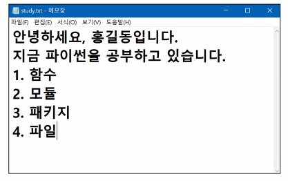
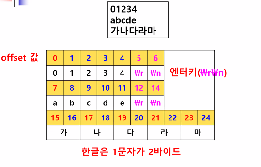
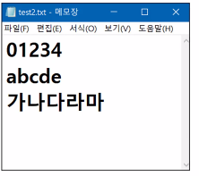

# 파이썬 기초(8)

> 파일

## 0. 파일 입출력

### 파일 생성, 열기

```python

```

```python
# 파일 생성: 파일명만 적으면 현재 디렉터리에 생성
f = open('file.txt','w') # f 변수에 파일을 참조할 수 있는 포인터 저장
f.close() # f가 포인터하고 있는 file을 닫는다

# 현재 폴더 외 다른 폴더에 파일을 만들고 싶으면 전체 경로를 적는다.
# 존재하지 않는 디렉터리에 생성하면 에러
# f=open('c:/python/file1.txt','w')  FileNotFoundError: [Errno 2] No such file or directory: 'c:/python/file1.txt'
# f.close()

# 존재하는 경로에는 생성
# 경로 표시는 / 사용 (\(역슬러시) 사용하려면 \\사용
파일객체 = open(파일명, 파일열기모드)# 열기모드 (r,w,a)
f=open('C:/Python_study/file1','w')
f=open('C:\\Python_study\\file1','w')
```

* 파일명만 적으면 현재 디렉터리에 파일 생성
* 존재하지 않는 디렉터리에 생성하면 에러
* r(read) : 읽기만 가능
* w(write) : 쓰기 가능, 파일이 존재하지 않으면 새로생성, 존재하면 초기화해서 열어줌 (기존 파일에 저장되었던 내용 삭제)
* a(append) : 파일 끝에 추가
* 파일 경로 표시는 `/` 또는` \\` 사용


### 파일 닫기

```python
close()
```


### 파일 쓰기

```python
# 파일에 data 보내기(쓰기) : 파일을 쓰기모드로 열고 파일 객체의 write() 함수로 값을 파일에 기록
data='안녕하세요, 반갑습니다.'
f=open('file1.txt','w',encoding='utf-8') #문자 인코딩 방식 저장(utf-8)
f.write(data)
f.close()
>>>
# file1.txt
안녕하세요, 반갑습니다.
```

* `ANSI` 로 저장되었을 경우 한글은 깨짐 --> 다른 이름으로 저장 후 인코딩 방식을 `UTF-8`로 바꾸어주거나, 생성시 인코딩 방식을 명시하여 저장
* PyCharm에서 txt 생성시 


#### 파일에 여러행 데이터 쓰기(`\n`)

```python
# 파일에 여러행 데이터 쓰기('/n')
f=open('file4.txt','w',encoding='utf-8')
for i in range(1,11) :
    data='%d행\n' % i
    f.write(data)
f.close()

>>>
# file4.txt
1행
2행
3행
4행
5행
6행
7행
8행
9행
10행
```


#### 파일로부터 읽어오기(read)

> open() mode:r



`test.txt`파일 생성 후 진행(`ANSI`)

##### `readline()`

> 첫 1개 행씩 읽어옴, 행 끝에 `\n` 포함

```python
f=open('test.txt','r')
line=f.readline() # 읽어올때는 ANSI, 내보낼떄는 UTF-8
print(line)
print('끝입니다.')
f.close()

# readline() 함수를 이용해서 전체라인 읽어오는 코드
# 결과는 1행 출력하고 줄바꿈 그리고 print문이 줄바꿈해서 2줄 간격이 생김
print('--------파일 전체 읽기-----------')
f2=open('test.txt','r')

while True:
    line=f2.readline() # 라인 1개 읽고 포인터를 다음행으로 이동
    if not line: # line에 아무것도 없으면 None 반환 --> False로 처리
        break
    # print(line) # 2줄 간격 출력됨
    print(line, end=' ') # print문의 줄바꿈 실행하지 않음

f2.close()
>>>
안녕하세요, 홍길동입니다.

끝입니다.
--------파일 전체 읽기-----------
안녕하세요, 홍길동입니다.
 지금 파이썬을 공부하고 있습니다.
 1 .함수
 2. 모듈
 3. 패키지
 4. 파일 
```


##### `readlines()`

>  모든 행을 읽어 라인별로 잘라서 리스트로 생성 후 반환

```python
# readlines()함수 이용
# 리스트형 반환
print('---전체 라인 읽고 출력---')
f2=open('test.txt','r')
lines=f2.readlines() # 리스트 생성
print(lines) # 전체line 읽어서 1행씩 출력
f2.close()

for line in lines:
    print(line, end=' ') # print문의 줄바꿈 실행하지 않음
f2.close()
>>>
---전체 라인 읽고 출력---
['안녕하세요, 홍길동입니다.\n', '지금 파이썬을 공부하고 있습니다.\n', '1 .함수\n', '2. 모듈\n', '3. 패키지\n', '4. 파일']
안녕하세요, 홍길동입니다.
 지금 파이썬을 공부하고 있습니다.
 1 .함수
 2. 모듈
 3. 패키지
 4. 파일 
```


##### `readlines()` 없이 파일 읽어오기

```python
# readlines() 없이 파일 읽어오기
f3=open('test.txt','r')
for line in f3: # 파일 객체를 직접 반복요소로 사용 가능, 내부적으로 f3.readlines() 자동수행되면서
    print(line,end=' ') # 1행식 출력
f3.close()
```


##### `read()`

>  내용 전체를 읽어서 문자열로 반환

```
# read() : 파일의 내용 전체를 읽어서 1개의 문자열로 반환하는 함수
f=open('test2.txt','r')
data=f.read()
print(data)
print(type(data))
print(len(data))
>>>
01234
abcde
가나다라마
<class 'str'>
17
```


##### 예제) 검색값을 입력받아 파일에 해당 검색값이 있는지 검색

```
# 검색값을 입력받아 파일에 해당 검색값이 있는지 검색
f=open('test2.txt','r')
data=f.read()
value=input('검색값 입력 : ')

if value in data:
    print('있음')
else:
    print('없음')
f.close()
```


##### `seek(offset,whence)`

> 파일 내에서 위치로 검색

* 

  

* `whence` : 위치

  0 시작위치, 1 현재위치, 2 파일의 끝 ex. (0,0)  : 0행 0열 (시작 위치)

* `offset` :
* 엔터 키 : `carrige return` + `line feed` = 2칸 차지



`test2.txt` 파일 생성 후 진행(`ANSI`)

```python
# 파일내포인터이동_seek
# 파일내에서 검색(위치이동)
# seek(offset, whence) 함수

print('----파일내에서 검색: seek()----')
f=open('test2.txt','r')
f.seek(0,0) # 시작위치 (offset, 위치) : 파일의 시작점에서 0번쨰에 위치
# (0,0) : 0행 0열(파일 시작위치)

# 파일 전체 읽어오기(리스트 반환)
lines=f.readlines()
print(lines) # 리스트 출력

# 포인터 위치 변경
f.seek(1,0) # offset(1), whence(처음) : 문서 처음에서 한 문자 옆으로 감
            # 1부터 데이터가 나타남
lines=f.readlines()
print(lines)

# 두번째 행부터 읽어오기
f.seek(7,0) # 옵셋1, 위치문서처음
lines=f.readlines()
print(lines) # 리스트 출력


# 한글은 2바이트
f.seek(14,0) # 시작위치부터 offset 14부터 읽어오기
lines=f.readlines()
print(lines) # 리스트 출력

f.seek(15,0) # UnicodeDecodeError: 'cp949' codec can't decode byte 0xb6 in position 0: incomplete multibyte sequence
lines=f.readlines()
print(lines) # 리스트 출력

f.seek(16,0) # 세번쨰 행 두번째 글자 (한글이므로 이전 글자 위치에서 2씩 증가시켜야 함)
lines=f.readlines()
print(lines) # 리스트 출력
f.close()
```


##### `append()`

> 파일 끝에 데이터를 추가, 파일열기모드 : a

```
# append, mode:a

f=open('test2.txt','a') # append 모드로 열고
ap_data='\n\nPython Programming'
f.write(ap_data) # write() 로 파일 끝에 데이터 추가
f=open('test2.txt','r')
print(f.read())

f.close()
>>>
01234
abcde
가나다라마

Python Programming
```


##### with문

>  파일을 자동으로 close하는 등 관리를 해주는 문장: with 문을 사용함
>
>  with문이 종료되면 파일 객체는 자동으로 `close()`

#####  

##### with문으로 파일열기

```python
 with open(파일명,열기모드) as 파일객체변수명:
           처리코드
```

```python
with open('test3.txt','w') as f:
    f.write('hello')
```


##### 변수로 처리

```python
file='test4.txt'
data='''Python programming
r programming
web programming'''

with open(file,'w') as f :
    f.write(data
            )
```


##### 예제) 멤버 정보 입력받아 csv 파일에 쓰기

```python
f=open('member.csv','w',encoding='utf-8')

while True:
    name=input('멤버이름을 입력하세요. 종료하려면 이번 입력에서 quit를 입력하세요.')
    if name == 'quit' :
        break
    birth=input('멤버 생년월일을 입력하세요. ')
    adr=input('주소를 입력하세요.')

    mem=name+','+birth+','+adr+'\n'
    f.write(mem)
f.close()
```

