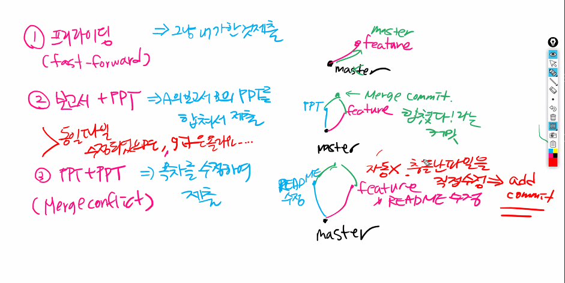
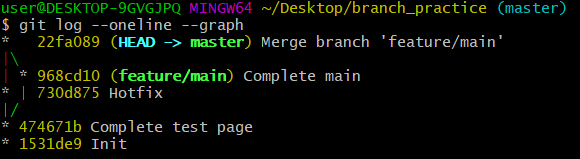

# Branch_기초명령어

### 0. 브랜치란

> 개발 업무를 서로 다른 독립적인 가지(branch)로 나누어서 개발한 후, 합치는 것


* 서비스 개발상에서 발생하는 문제, 갱신사항을 반영하기 쉽다.

* master 지금 운영중인 코드 ex. 12/23에 보는 포털 페이지

* hotfixes 지금 운영중인 코드에 중대한 오류가 발생했을 시

  

### 1. 브랜치 기초 명령어

* branch 생성

  ```bash
  $ git branch 브랜치명
  ```

  

* branch 이동
  ```bash
  $ git checkout 브랜치명
  ```
* branch 생성 및 생성한 branch로 이동 (-b 옵션)
  ```bash
  $ git checkout -b 브랜치명
  ```
* branch 병합
  ```bash
  (master) $ git merge 브랜치명
  ```
* branch 삭제
  ```bash
  $ git branch -d 브랜치명
  ```


### 2. 브랜치 상황



#### 상황 1. fast-foward

> fast-foward는 feature 브랜치 생성된 이후 master 브랜치에 변경 사항이 없는 상황
>
> ex) 한 팀원이 프리라이딩

1. ##### feature/test branch 생성 및 이동

   ```bash
   $ git branch feature/test
   $ git branch
     feature/test
   * master
   $ git checkout feature/test #f누르고 tab => 자동완성
   Switched to branch 'feature/test'
   ```

   * 윈도우의 경우 현재 작업중인 브랜치명 (feature/test) 잘 확인하기

2. ##### 작업 완료 후 commit

   ```bash
   $ touch test.txt
   $ git add .
$ git commit -m 'Complete test page'
   $ git log --oneline
   #hash 값, HEAD->(지금내가있는 위치 표시)
   474671b (HEAD -> feature/test) Complete test page
   1531de9 (master) Init
   ```
   


3. ##### master 이동
   
   ```bash
   $ git checkout master
   Switched to branch 'master'
   ```
   


4. ##### master에 병합
   
   ```bash
   $ git merge feature/test
   Updating 1531de9..474671b
   Fast-forward
    test.txt | 0
    1 file changed, 0 insertions(+), 0 deletions(-)
    create mode 100644 test.txt
   ```
   


5. ##### 결과 -> fast-foward (단순히 HEAD를 이동)
   
   ```bash
   $ git log --oneline
   474671b (HEAD -> master, feature/test) Complete test page
1531de9 Init
   ```
   
6. ##### branch 삭제
   
   ```bash
   $ git branch -d feature/test
   Deleted branch feature/test (was 474671b).
   ```
   
   * 이미 master에 merge가 끝난 가지는 삭제해도 된다.

---

#### 상황 2. merge commit

> 서로 다른 이력(commit)을 병합(merge)하는 과정에서 다른 파일이 수정되어 있는 상황
>
> git이 auto merging을 진행하고, commit이 발생된다.

1. ##### feature/main branch 생성 및 이동

   ```bash
   $ git checkout -b feature/main
   Switched to a new branch 'feature/main'
   ```

2. 작업 완료 후 commit

   ```bash
   $ touch main.txt
   $ git add .
   $ git commit -m 'Complete main'
   $ git log --oneline
   968cd10 (HEAD -> feature/main) Complete main
   474671b (master) Complete test page
   1531de9 Init
   ```

3. master 이동
   ```bash
   $ git checkout master
   Switched to branch 'master'
   (master)
   ```
```
   
4. *master에 추가 commit 이 발생시키기!!*

   * **다른 파일을 수정 혹은 생성하세요!**
   ```bash
   $ touch hotfix.txt
   $ git add .
   $ git commit -m 'Hotfix'
   [master 730d875] Hotfix
    1 file changed, 0 insertions(+), 0 deletions(-)
    create mode 100644 hotfix.txt
```

5. master에 병합
   ```bash
   $ git merge feature/main
   Merge made by the 'recursive' strategy.
   ```

6. 결과 -> 자동으로 *merge commit 발생*

   * vim 편집기 화면이 나타납니다.

   * 자동으로 작성된 커밋 메시지를 확인하고, `esc`를 누른 후 `:wq`를 입력하여 저장 및 종료를 합니다.
     * `w` : write
     * `q` : quit

   * 커밋을  확인 해봅시다.
   ```bash
   $ git log --oneline
   22fa089 (HEAD -> master) Merge branch 'feature/main'
   730d875 Hotfix
   968cd10 (feature/main) Complete main
   474671b Complete test page
   1531de9 Init
   ```
   
7. 그래프 확인하기

   

   ```bash
   $ git log --oneline --graph
   *   22fa089 (HEAD -> master) Merge branch 'feature/main'
   |\
   | * 968cd10 (feature/main) Complete main
   * | 730d875 Hotfix
   |/
   * 474671b Complete test page
   * 1531de9 Init
   ```

   

8. branch 삭제

   ```bash
   $ git branch -d feature/main
   Deleted branch feature/main (was 968cd10).
   ```

   

---

#### 상황 3. merge commit 충돌

> 서로 다른 이력(commit)을 병합(merge)하는 과정에서 동일 파일이 수정되어 있는 상황
>
> git이 auto merging을 하지 못하고, 해당 파일의 위치에 라벨링을 해준다.
>
> 원하는 형태의 코드로 직접 수정을 하고 merge commit을 발생 시켜야 한다.
>
> ex. ppt 만드는데 목차 충돌

1. feature/board branch 생성 및 이동

   ```bash
   $ git checkout -b feature/sub
   $ touch sub.txt
   $ fit add .
   
   ```

   ```bash
   #=> git add .
   ```

   

2. 작업 완료 후 commit
   ```bash
   
   ```
   


3. master 이동
   ```bash
   
   ```
   


4. *master에 추가 commit 이 발생시키기!!*

   * **동일 파일을 수정 혹은 생성하세요!**
   ```bash
   
   ```
   
5. master에 병합
   ```bash
   
   ```
   


6. 결과 -> *merge conflict발생*
   ```bash
   $ git merge feature/sub
   CONFLICT (add/add): Merge conflict in README.txt
   Auto-merging README.txt
   Automatic merge failed; fix conflicts and then commit the result.
   ```
   


7. 충돌 확인 및 해결
   ```bash
   
   ```
   


8. merge commit 진행

   ```bash
   $ git commit
   ```

   * vim 편집기 화면이 나타납니다.

   * 자동으로 작성된 커밋 메시지를 확인하고, `esc`를 누른 후 `:wq`를 입력하여 저장 및 종료를 합니다.
     * `w` : write
     * `q` : quit

   * 커밋이  확인 해봅시다.

9. 그래프 확인하기
   ```bash
   
   ```
   


10. branch 삭제
   ```bash
   
   ```
