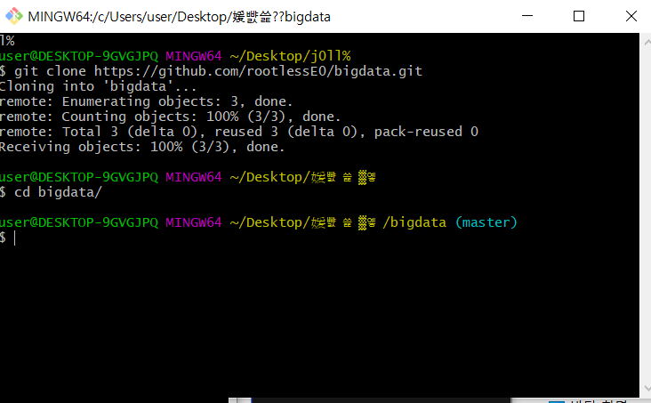

## Clone


* CODE -> URL 복사

```bash
$ git clone URL 
```

* 타인의 파일 다운로드 할 수 있음

* 원격저장소 이름의 폴더 생성

* download.zip으로 받을 수도 있음 => 가장 최신 파일만. 이력은 받을 수 없음(master X)

* 주의 clone 이후 프로젝트 폴더로 이동해야함!(아래사진)




## Pull origin master


## DVCS vs CVCS

* DVCS(분산형 버전 관리 시스템)

  * 장점 : 메인 서버가 없어져도 모든 버전 이력 유지 가능

  

* CVCS(중앙집중형 버전 관리 시스템)
  
  * 단점 : 메인 서버 망가지면 버전 이력 유지 불가능


## github에서 바로 파일 생성하기

push 할 시 오류! => 서로 다른 커밋으로 인해 충돌 발생

```bash 
$ git pull
```

명령어로 다른 커밋을 합쳐준다.


