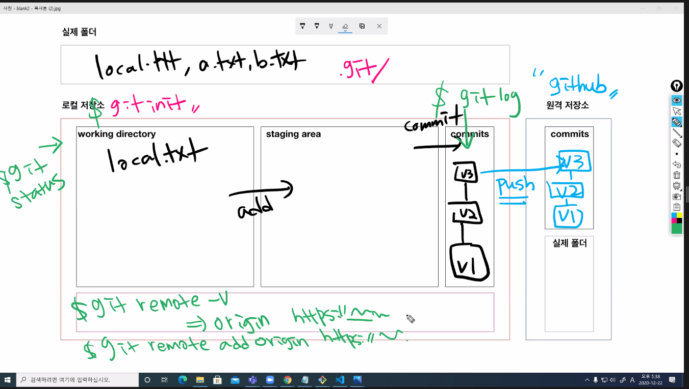

# Git 기초문법

> git은 분산형 버전관리시스템(DVCS)이다.


## Git 사전준비

1. 윈도우 : [git bash](https://gitforwindows.org/)를 설치한다.
2. 로컬 설청

```bash
$ git config --global user.name 'rootlessE0'
$ git config --global user.email 'sunoju03@gmail.com'
```

* 처음 git을 설치하면, commit을 하는 작성자를 설정해야한다.
* email 정보는 github에 등록된 이메일을 설정하는 것을 추천(잔디밭)

```bash
$ git config --global -l
user.name=rootlessE0
user.email=sunoju03@gmail.com
```

* 설정된 내용을 확인하기 위해서는 아래의 명령어를 입력한다.
* 오프라인 강의장에서 하는 경우 반드시 체크!(자리가 바뀌었을경우 user가 다를 수 있음)

./git 폴더를 삭제하면 지금까지 commit한 버전들이 모두 사라진다.


## 기초흐름

작업=>add=>commit

작업이 끝나면 커밋할 파일을 모아서 add, commit


### 0. 저장소 설정

```bash
$ git init
Initialized empty Git repository in C:/Users/user/Desktop/정리/.git/
(master) $ 
```

* git 저장소로 활용하기 위해서는 위의 명령어를 활용한다.
  * `.git` 폴더가 생성
  * `(master)` 로 현재 작업중인 브랜치 확인


### 1. `add`

> 커밋을 위한 파일 목록(stageing area)

```bash
$ touch test.txt
```

* add 전 모습

```bash
$ git status
On branch master

No commits yet
# 트래킹이 되지 않는 파일 : WD에 있는 파일
Untracked files:
# git add 명령어를 사용
# 커밋이 될 것에 포함시키기 위해
  (use "git add <file>..." to include in what will be committed)
        test.txt
# 맨 마지막줄 : 총 정리
# noting added to commit / 커밋하기 위해 추가된 것 X : staging area X
# untracked files present : WD O
nothing added to commit but untracked files present (use "git add" to track)
```

* add 후 모습

```bash
$ git status
On branch master

No commits yet
# 커밋이 될 변경사항 : SA에 있는 파일
Changes to be committed:
  (use "git rm --cached <file>..." to unstage)
  #새 파일 : test.txt
        new file:   test.txt
```


### 2. `commit`

> 버전을 기록(스냅샷)

```bash
$ git commit -m '커밋 메세지'

```

* 커밋 메시지는 현재 작업의 내용을 알 수 있도록 명확하게 작성한다. 

  * 참고 url

    [커밋메시지사전](https://blog.ull.im/engineering/2019/03/10/logs-on-git.html) 

    [커밋메시지약속](https://meetup.toast.com/posts/106)

* 커밋 이력을 확인하기 위해서는 아래의 명령어를 활용한다. 

```bash
$ git log
uthor: rootlessE0 <sunoju03@gmail.com>
Date:   Tue Dec 22 14:36:36 2020 +0900

    커밋 메세지
```

* 추가옵션

```bash
$ git log --oneline #최근꺼 하나
$ git log --oneline -l #최근 
```

이력을 하나씩 보고싶을 때 이렇게 한다.


### 3. `status`

```bash
$ git status
On branch master
# 2)
Changes not staged for commit:
  (use "git add/rm <file>..." to update what will be committed)
  (use "git restore <file>..." to discard changes in working directory)
        modified:   1.txt
        deleted:    2.txt

# 1) untracked files
Untracked files:
  (use "git add <file>..." to include in what will be committed)
        3.txt

no changes added to commit (use "git add" and/or "git commit -a")
```

* working directory에서 파일의 상태
  * `untracked files` : 깃이 관리하고 있지 않은 파일(커밋에 들어간 적 없음)
    * 파일생성(new file)
  * tracked : 이전 커밋에 포함된 적 있는 파일
    * `modified`
      * `modified` / `deleted`
    * `unmodified`
      * 수정 안 됨 => git status에 등장하지 않음


## 원격저장소(remote repository) 활용

> 원격 저장소를 제공하는 서비스는 github, gitlab, bitbucket 등이 있다.

github에서 상단 프로필 옆 + 버튼 > new repository 클릭후 이름 적어 생성한다.

commit을 마친 후에 진행한다.

### 1. 원격 저장소 설정하기

```bash
$ git remote add origin '저장소 url'
```

* 외우는 법: 깃아, 원격저장소를 추가해줘(add) origin이라는 이름으로 url을!!

* 원격저장소 설정을 삭제(remove)하는 명령어는 다음과 같다.

  ```bash
  $ git remote rm origin
  ```


### 2. 원격 저장소 url 확인하기

```bash
$ git remote -v
```


### 3. `push`(업로드)

```bash
$ git push origin master
```

* origin이라는 원격 저장소, master라는 브랜치에 업로드한다.


## 총정리




## 기타

### 개발공부 습관

* 정리하는 습관
  * github, md로 잘 정리한다.
  * README로 개요를 작성한다.


### 절대경로와 상대경로 차이

* 절대경로: c드라이브부터 타고 들어가는 것.

* 상대경로: 현재 디렉토리에서 이동. (./폴더이름) 
  * git 내에서도 이동할 수 있다.
  * 파일>환경설정 > 이미지에서 '가능하다면 상대경로로 설정'시 깨지지 않는 이미지를 볼 수 있다.


### 정적 탬플릿 생성기

> markdown을 html 로 바꾸어주는 것으로 저장소를 html으로 작성된 블로그로 사용할 수 있다.

* jEKYLL : 과거부터 많이 사용되어 왔던 것. 자료가 많다.
* Gatsby : 최신 기술을 많이 지원한다. 


### 폴더이동

* a/b/c.txt라면

  a폴더에 위치한 상태에서 c. txt : ./b/c.txt

  b폴더에서 a폴더 : ../c.txt