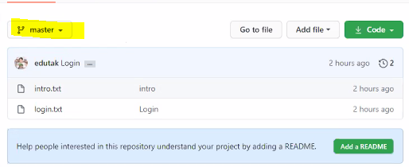

# 원격저장소(remote repository) 활용

> 원격 저장소를 제공하는 서비스는 github, gitlab, bitbucket 등이 있다.

## 1. 원격 저장소 설정하기

```bash
$ git remote add origin '저장소 url'
```

* 외우는 법: 깃아, 원격저장소를 추가해줘(add) origin이라는 이름으로 url을!!

* 원격저장소 설정을 삭제(remove)하는 명령어는 다음과 같다.

  ```bash
  $ git remote rm origin
  ```

## 2. 원격 저장소 확인하기

```bash
$ git remote -v
```

## 3. `push`

```bash
$ git push origin master
```

* origin을 master에 업로드한다.

